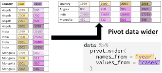
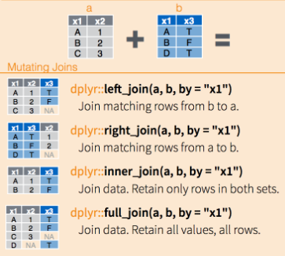
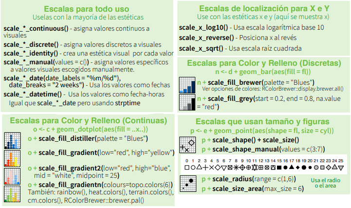
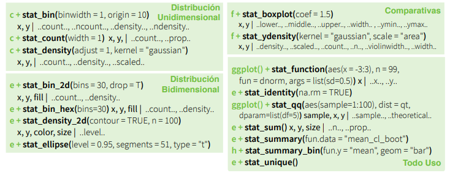
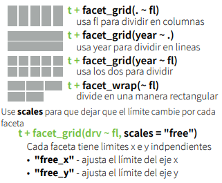
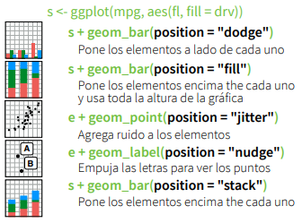
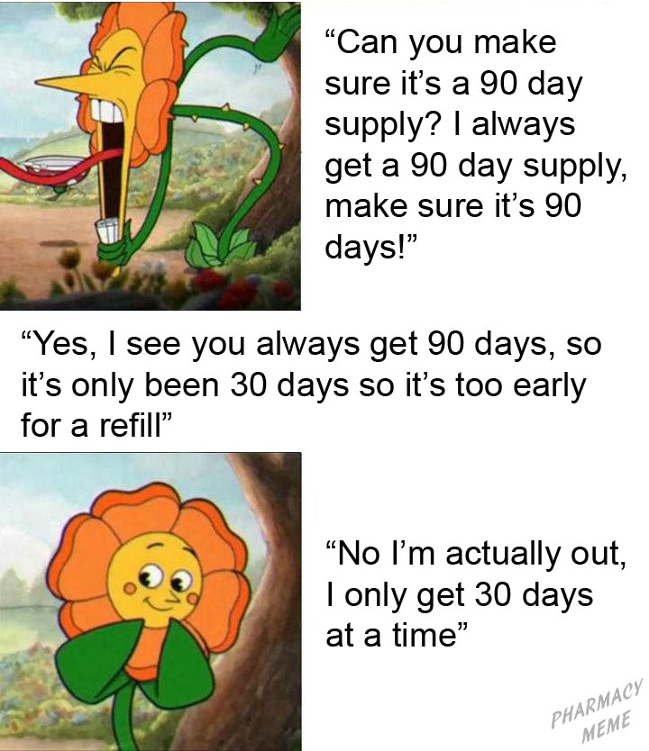
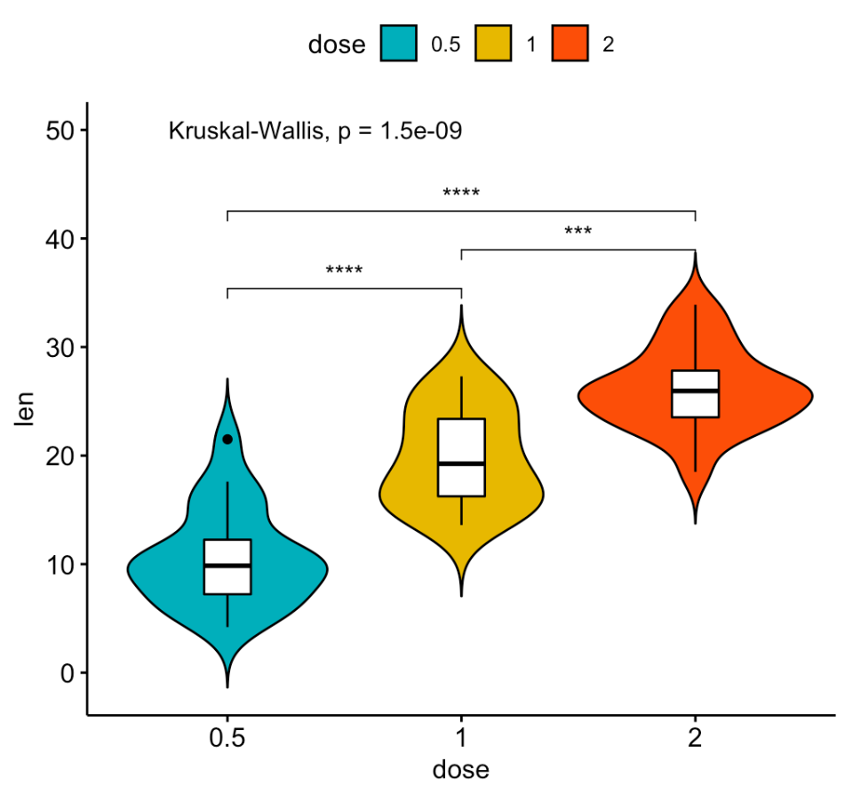

## Introducción al Análisis de Datos

## La estadística y el método científico

-   La ciencia avanza definiendo teorías que intentan explicar el mundo.

-   La comunidad científica elabora teorías/hipótesis que intentan explicar hechos que ocurren. Una hipótesis es científica si existe alguna manera de comprobar su veracidad.

-   Podemos diseñar experimentos para comprobar si se cumplen las afirmaciones de la teoría.

-   Como la naturaleza tiene un comportamiento con "incertidumbre", es decir, que si repetimos el experimento se obtienen resultados similares pero no idénticos, la estadística permite analizar estos resultados y ver si las desviaciones de la teoría son razonables o no.

-   Se ha definido estadística de muchas maneras. La que más nos gusta, y que está relaciona con la situación que acabamos de explicar, es que:

> La **estadística** es la ciencia que permite adquirir conocimiento generalizable a partir de datos.

-   La estadística ayuda en todas las fases del método científico:

    -   [*Planteamiento del problema*]{style="color: blue;"}: Diseño de experimentos y encuestas, determinación del tamaño de la muestra y métodos de muestreo adecuados para garantizar que los datos recopilados sean representativos de la población objetivo.

    -   [*Recopilación de datos*]{style="color: blue;"}: Proporciona herramientas para recopilar y organizar datos relevantes sobre el problema.

    -   [*Análisis de datos*]{style="color: blue;"}: Aplicación de técnicas descriptivas (Análisis explorartorio de datos), así como técnicas inferenciales (contrastes de hipótesis, ajustes de modelos,etc) para sacar conclusiones sobre la población en función de la muestra recopilada.

    -   [*Interpretación de resultados*]{style="color: blue;"}: Ayuda a los científicos a determinar si los resultados son estadísticamente significativos y si las conclusiones se pueden generalizar a la población más amplia.

    -   [*Comunicación de hallazgos*]{style="color: blue;"}: La estadística se usa para comunicar los resultados de manera efectiva a través de gráficos, tablas y tests estadísticos. Esto es esencial para que otros investigadores puedan comprender y evaluar los resultados.

    -   [*Reproducibilidad*]{style="color: blue;"}: Proporciona métodos estadísticos claros y transparentes, se permite que otros repitan los experimentos y análisis para verificar la validez de los hallazgos.

    -   [*Toma de decisiones*]{style="color: blue;"}: En muchos campos científicos, los resultados estadísticos se utilizan para tomar decisiones importantes. Por ejemplo, en la medicina, la estadística se usa para evaluar la eficacia de tratamientos y tomar decisiones sobre su uso en la práctica clínica.

-   Cuando alguien realiza un nuevo descubrimiento lo envía a una revisión por pares de la comunidad científica. Para que estos acepten el descubrimiento y pase a formar parte del conocimiento científico debes poner a disposición:

    -   Los datos brutos (raw data) junto con el modelo de datos.

    -   El código parametrizado y con las líneas más importantes comentadas.

    -   La documentación (artículo/ reporte) donde se interpretan y presentan los resultados más relevantes.

En resumen, la estadística es una herramienta esencial que ayuda a garantizar que la investigación científica sea rigurosa, confiable y basada en evidencia sólida.

## Gestión básica de datos


-   En estadística, siempre se empieza obteniendo unos **datos** sobre un grupo (relativamente pequeño) de individuos de una población. Bueno, en realidad, no se empieza obteniendo los datos, sino planificando cuidadosamente cómo se van a obtener, pero todo forma parte de la "obtención" de los datos.

-   Se **generaliza la información** que se ha obtenido sobre este grupo de personas al total de la población.

-   Y no se trata de trucos de magia adivinatoria, sino de una **ciencia** cuya metodología ha sido validada por medio de demostraciones matemáticas o, en el peor de los casos, mediante simulaciones numéricas (el equivalente en matemáticas de los experimentos en las otras ciencias).

Así pues, la situación de partida a la hora de aplicar técnicas estadísticas es que disponemos de un conjunto de datos que describen algunas características de un grupo de individuos. El análisis estadístico de estos datos puede ser entonces de dos tipos básicos:

-   **Análisis exploratorio de datos**, cuando nuestro objetivo sea simplemente resumir, representar y explicar los datos concretos de los que disponemos. La **estadística descriptiva** es el conjunto de técnicas que se usan con este fin.

-   **Análisis inferencial**, si nuestro objetivo es deducir (**inferir**), a partir de estos datos, información significativa sobre el total de la población de interés. Las técnicas que se usan en este caso forman la **estadística inferencial**.

{width="80%" fig-align="center"}

Ambos tipos de análisis están relacionados. Por un lado, porque es conveniente (obligatorio, en nuestra opinión) empezar cualquier análisis inferencial dando un vistazo a los datos que se usarán.

Por otro, porque muchas técnicas descriptivas permiten estimar propiedades de la población de la que se ha extraído la muestra. Por citar un ejemplo, la media aritmética de las alturas de un grupo de individuos nos da un valor más o menos representativo de sus alturas, pero también sirve para *estimar* la altura media de los individuos de la población total.

La estadística inferencial entra en juego cuando se quiere obtener información sobre una población y no se puede acceder a todos sus integrantes. Si por ejemplo queremos conocer la altura media de los estudiantes matriculados en esta asignatura de la UIB en este curso, en principio no necesitamos para nada la estadística inferencial. Sois pocos, os mediríamos a todos y calcularíamos la media. En todo caso, usaríamos técnicas de estadística descriptiva para arropar este valor representando la distribución de vuestras alturas de manera adecuada.

Pero si quisiéramos conocer la altura media de los mallorquines entre 18 y 25 años, sería muy complicado medirlos a todos. Entonces, lo que haríamos sería tomar una muestra representativa de esta población, medirlos y a partir de sus alturas estimar dicha altura media. Naturalmente, lo más seguro es que de esta manera no obtuviéramos el valor exacto de la altura media de los mallorquines de 18 años, nos tendríamos que conformar con obtener una aproximación dentro de un cierto margen de error y determinar la probabilidad de acertar con nuestra estimación y este margen de error. La estadística inferencial es la que nos permite acotar el error que podamos haber cometido y calcular la probabilidad de cometerlo, incluyendo la metodología que tendríamos que haber usado para tomar la muestra en primer lugar.

## R/ RStudio - Posit / RMarkdowm - Quarto

Todas las técnicas que usaremos en la asignatura pueden ser implementadas y/o desarrolladas en software libre como Python y R. Ambos se consideran lenguajes de programación esenciales para la ciencia de datos. Lo ideal sería dominar ambos para tener una base de programación completa, pero:

-   R es un **lenguaje específico utilizado para el análisis de datos y la estadística**.

-   R es muy adecuado para un sub-campo del aprendizaje automático conocido como aprendizaje estadístico. Cualquier persona con una formación formal en estadística debería reconocer la sintaxis y la construcción de R.

-   Al igual que Python, R cuenta con una sólida comunidad, estructurada alrededor de la "Comprehensive R Archive Network", o CRAN, pero no ofrece un desarrollo de software de propósito general como Python.

-   Cada día salen nuevos paquetes que extienden las funcionalidades de R y cubren casi todas las necesidades computacionales y estadísticas de un científico. Para que os hagáis una idea, en el momento de revisar estas notas (septiembre de 2023) el número de paquetes en el repositorio de la CRAN acaba de superar los 19800.

-   El acceso a R se proporciona a través de RStudio, entorno que presenta una ventana de visualización, un explorador de archivos, un visor de datos y un editor. Este entorno suele ser menos intimidante que el shell de R. Además, cuenta con ayuda integrada, resaltado de sintaxis y completado contextual por tabulaciones; todas estas herramientas facilitan el trabajo.

-   RStudio tiene un nuevo nombre desde julio de 2022: **Posit**. Posit es una palabra que significa proponer una idea para su discusión, proviene de la aspiración científica de construir niveles cada vez mayores de conocimiento y comprensión de experimentos que generan 

{width="80%" fig-align="center"}

-   Posit tiene como misión la creación de software libre y de código abierto para la ciencia de datos, la investigación científica y la comunicación técnica. Han incluido algunas herramientas para Python a través de **Quarto**.

-   Quarto está pensado como un cuaderno de laboratorio moderno donde predomina R pero que soporta código Python (`reticulate`), SQL, Julia, entre otros; pensado para experimentos que requieren multilenguaje.

-   **Posit Cloud** permite acceder al potente conjunto de herramientas de ciencia de datos de Posit directamente desde su navegador. Esto favorecerá el trabajo en equipo. Podéis revisar la siguiente [Guía](https://posit.cloud/learn/guide) para crearos una cuenta.


## Control de versiones con Git / GitHub

* En esta asignatura la forma de llegar a un resultado de análisis de datos es tan importante como el propio resultado. Además, uno de los objetivos es exponeros al uso de herramientas de software para la ciencia de datos moderna. 

* La idea de reproducibilidad lleva implícita la colaboración. El código que se produce es parte de la documentación del proceso y es fundamental compartirlo (aunque sólo sea con uno mismo).

* Lo anterior se logra mejor con un sistema de control de versiones distribuido como **Git**.  Mantener un registro sobre los proyectos, es lo que permite rastrear y gestionar cambios en el código a lo largo del tiempo. Se puede decir que nos permite guardar el progreso de nuestro código de tal forma que, si en algún momento cometemos algún error irreversible en una versión posterior, siempre podremos recuperar una versión anterior en la que todo funcionaba correctamente y retomar el proyecto desde ese punto.

* Git permite la colaboración, pero carece de características sociales y herramientas específicas para la colaboración en equipo. **GitHub** proporciona herramientas para la revisión de código, la gestión de problemas y la colaboración en proyectos.

{width="50%" fig-align="center"}

* GitHub es un servicio en la nube donde se pueden subir repositorios propios y compartir el código con otras personas de tal forma que sea accesible desde Internet.


* Un repositorio funciona como una carpeta virtual. En él se encuentran todos los archivos de un proyecto y el historial de revisiones de cada uno, permitiendo restablecer una versión del código en caso de error en su ejecución.

* Podemos ver proyectos de otras usuarios, valorarlos, proponer mejoras en el código, GitHub es una de las aplicaciones que mejora la gestión de proyectos y el acceso a recursos compartidos.

* En octubre del 2021 se estrenó **GitHub Copilot**, una herramienta de inteligencia artificial en la nube desarrollada conjuntamente entre GitHub y OpenAI. Su objetivo es sugerir y autocompletar el código escrito en entornos de desarrollo integrados (IDE).

> En esta clase, utilizaremos GitHub como sistema de gestión del aprendizaje para distribuir y recopilar las entregas como repositorios.

* Crearemos en GitHub un repositorio por estudiante/equipo para cada entrega. Utilizaremos un sencillo flujo de trabajo centralizado que sólo requiere realizar acciones simples como push, pull, add, rm, commit, status y clone.

### Git / GitHub con R

Veamos cómo configurar todo. Gran parte de lo que está aquí proviene del libro [Happy Git and GitHub for the useR](https://happygitwithr.com/) de Jenny Bryan y del artículo de [David Keyes](https://rfortherestofus.com/2021/02/how-to-use-git-github-with-r/)   puedes ver sus vídeos en caso de que, la breve explicación que presentamos abajo, no sea suficiente para ti.

 -   [*Instalar Git*]{style="color: blue;"}: El primer paso es instalar Git, en el [Capítulo 6 del libro](https://happygitwithr.com/install-git) explican el proceso para los usuarios de Mac, Windows y Linux. Nosotros ya lo tenemos instalado, así que mostramos cómo verificar si tienes Git instalado y su versión usando el terminal en RStudio. 
 
 En el terminal de RStudio:


::: {.cell}

```{.r .cell-code}
which git # ruta donde está instalado el Git
git --version # version
```
:::


 
 -   [*Configurar Git (Editar gitconfig file)*]{style="color: blue;"}:El siguiente paso es configurar Git. Esto se trata en el Capítulo 7 del libro, aunque mostramos lo que creemos es un proceso un poco más fácil. Específicamente, sugerimos usar la función `edit_git_config()` del paquete `usethis`, que abrirá su archivo gitconfig. Agrega tu nombre y correo electrónico y cierra esto.
 
 En la consola de RStudio:
 


::: {.cell}

```{.r .cell-code}
library(usethis)
usethis::edit_git_config()
# Modificar en el fichero ".gitconfig" los apartados: "name" y "email" 
# y guardar el fichero
```
:::


 

-   [*Inicializar un repositorio Git*]{style="color: blue;"}: Ahora que has instalado y configurado Git, puedes usarlo localmente. La función `use_git()` agregará un repositorio Git (a menudo denominado “repositorio”) a un proyecto RStudio existente. Aquí crearemos un nuevo proyecto y luego inicializaremos un repositorio de Git.

En RStudio:
* Crear un proyecto nuevo

* Seleccionar “Nuevo Directorio”

* Proyecto
    -  Activar: “Create a git repository”
    
En la consola de RStudio:


::: {.cell}

```{.r .cell-code}
library(usethis)
usethis::use_git()
# Elegir siempre la opción: 1
# Y ante la ventana, seleccionar: "Save"
```
:::


Y visitar la pestaña: “Git” en RStudio.

-   [*Ver historial de confirmación*]{style="color: blue;"}: Ahora que tu proyecto de RStudio tiene un repositorio Git asociado, verás una pestaña adicional en la parte superior derecha: la pestaña Git. Desde aquí, puedes ver todo el historial de cambios en tu código a lo largo del tiempo (¡todavía no muchos!).

En RStudio:

Visitar la pestaña: “Git” de RStudio
Pulsar el icono del reloj para ver el historial de “Commit” realizados para ver el “Initial Commit”.

-   [*Hacer una confirmación (commit) y ver más historia*]{style="color: blue;"}: Git no realiza un seguimiento automático de los cambios de la manera en que lo hace una herramienta como Google Docs. En su lugar, tienes que decirle a Git: Hice cambios y quiero que mantengas un registro de ellos. Decirle a Git esto se llama hacer una confirmación (commit) y puedes hacerlo desde RStudio.

Cada commit tiene un mensaje de confirmación, lo que es útil porque, cuando miras tu historial de código, ves lo que hiciste en cada momento (es decir, en cada commit). RStudio tiene una herramienta integrada para ver su historial de código. Puedes hacer clic en cualquier commit para ver qué cambió, en relación con el commit anterior. Las líneas que se agregaron en verde; y las que se eliminaron en rojo.

En RStudio:

* Crear un fichero de script R: “test.R” y guardarlo.

* Visita la pestaña “Git” de RStudio y pulsa sobre el botón de “commit” para confirmar la creación del fichero: “test.R”.

* En el panel del commit añada un texto que lo defina.

* Haz varios cambios en el fichero “test.R” y en cada uno de ellos haz de nuevo un “commit”.

* Revisa luego la historia de los cambios que se han producido en el historial (pulsar el icono del reloj).

* Observa los nuevos cambios resaltados en color verde.
Frente a los valores antiguos que aparecerán en color rojo.

### Conectar RStudio y GitHub

El proceso hasta ahora nos ha permitido usar Git localmente. Pero, ¿qué pasa si queremos conectarnos a GitHub? ¿Cómo lo hacemos?

La mejor manera de conectar RStudio y GitHub es usando tu nombre de usuario y un token de acceso personal (PAT). Para generar un token de acceso personal, usa la función `create_github_token()` de `usethis`. Esto te llevará a la página correspondiente en el sitio web de GitHub, donde le darás un nombre a tu token y lo copiarás (¡no lo pierdas porque nunca volverá a aparecer!).

En la consola de RStudio:


::: {.cell}

```{.r .cell-code}
library(usethis)
usethis::create_github_token()
```
:::


* Pulsa sobre el enlace que aparece en la salida en la consola.

* Se abrirá una página web de Github en la que tendrás que pulsar el botón “Generate token”.

* Copia el token que aparece en Github (lo utilizarás en el siguiente paso).

* Ahora que has creado un token de acceso personal, debes almacenarlo para que RStudio pueda acceder a él y sepa conectarse a tu cuenta de GitHub. La función `gitcreds_set()` del paquete `gitcreds` te ayudará aquí. Ingresará tu nombre de usuario de GitHub y el token de acceso personal como contraseña (NO tu contraseña de GitHub). Una vez que hayas hecho todo esto, ¡habrás conectado RStudio a GitHub!.

En la consola de RStudio:


::: {.cell}

```{.r .cell-code}
library(gitcreds)
gitcreds::gitcreds_set()
# Ante la pregunta: "Enter password or token"
# introduce el token copiado en el paso anterior
```
:::


### Conectar proyectos de RStudio con repositorios de GitHub

Ahora que hemos conectado RStudio y GitHub, discutamos cómo hacer que los dos funcionen juntos. La idea básica es que configures los proyectos que creas en RStudio con repositorios GitHub asociados. Cada proyecto de RStudio vive en un solo repositorio de GitHub.

¿Cómo conectamos un proyecto de RStudio a un repositorio de GitHub? Happy Git and GitHub for the useR propone tres estrategias. Demostraremos la forma más sencilla

 crear un repositorio en GitHub primero. Cree el repositorio y, a continuación, cuando inicie un nuevo proyecto en RStudio, utilice la opción de control de versiones, introduzca la URL de su repositorio y listo.

**GitHub primero**

Crea el repositorio en GitHub y, a continuación, cuando inicies un nuevo proyecto en RStudio, utiliza la opción de control de versiones, introduce la URL de tu repositorio y listo.

Para bajar un repositorio creado en Github a un proyecto local en RStudio, tendréis que realizar los siguientes pasos:

* Crear un nuevo repositorio en nuestra cuenta de Github (o utilizar uno ya existente): pulsar el botón “Create repository”.

* Copiar al portapapeles la primera dirección que aparece (pulsando el botón de la derecha). Coincide con la dirección url que aparece en la barra del navegador.

* En RStudio seleccionamos crear “New project”, elegimos “Version Control” y luego seleccionamos “Git”.

* Introducimos en el primer cuadro de texto la url copiada anteriormente. Pulsamos “Create Project”.

* A continuación podrás consultarse la pestaña “Git” y ver la información asociada al repositorio descargado.

### Flujo de trabajo general

Ahora que hemos conectado RStudio y GitHub, podemos compartir nuestro trabajo entre los dos.

**Push (Subir a Github)**

"Push" significa enviar cualquier cambio en tu código de RStudio a GitHub. Para hacer esto, primero tenemos que hacer un commit. Después de confirmar, ahora tenemos un botón (la flecha hacia arriba) en RStudio que podemos usar para enviar nuestro código a GitHub.

En RStudio:

* Creamos un nuevo fichero de script R o un fichero Rmd y lo guardamos.

* Pulsamos en la pestaña “Git” sobre el botón de “commit”.
Marcamos todos los ficheros sobre los checks de “Staged”, rellenamos la descripción del commit y pulsamos sobre el botón de “commit”.

* Después de hacer el commit, pulsamos sobre el botón “Push” para subir los cambios a Github.

* A continuación puedes comprobar en la página de Github del repositorio que se han actualizado los últimos ficheros considerados en el último commit.

**Pull (Descargar desde Github)**

Lo opuesto a "empujar"Push" es bajar ("Pull"). Utilizando el botón de flecha hacia abajo, RStudio va al repositorio de GitHub, toma el código más reciente y lo lleva a su editor local. 

Hacer "Push" regularmente es extremadamente importante si estás colaborando, aunque si eres el único que trabaja en un proyecto de RStudio y un repositorio GitHub asociado, sabes que tu código local coincide con lo que está en GitHub, por lo que es menos importante.

En la página de Github de nuestro repositorio:

* Editamos uno de los ficheros de nuestro repositorio pulsando sobre el icono de un lápiz (a la derecha).
Realizamos alguna modificación sobre el fichero (o ficheros).

* Pulsamos en la parte inferior de la página en el botón de “Commit changes” (rellenando los comentarios que creamos oportunos sobre el commit que se está realizando).
Se puede navegar por la página de Github para consultar todos los commits realizados (y mucha más información).

Volvemos a RStudio:

* En la pestaña “Git” pulsamos sobre el botón de la flecha que apunta hacia abajo (verde) para realizar un “Pull” o descarga de los cambios en Github a nuestro proyecto local en RStudio.

* Después de eso puedes comprobare que los ficheros locales de nuestro proyecto se han actualizado con los cambios que se han producido en el repositorio.

**¡Lo lograste!**

¡Ahora está todo configurado para usar Git y GitHub con RStudio!


## Los datos y sus tipos

En vuestro curso de Estadística estudiasteis algunas técnicas básicas de estadística descriptiva. Estas técnicas consisten en una serie de valores y gráficos que nos permiten resumir y explorar un conjunto de datos, con el objetivo final de entenderlos o describirlos lo mejor posible.

Los datos de los que disponemos suelen ser multidimensionales, en el sentido de que observamos varias características (**variables**) de una serie de individuos. Almacenamos estos datos en **tablas de datos** como la que presentamos abajo, donde cada columna corresponde a una variable y cada fila son los datos de un individuo concreto. Así, en esta tabla, cada fila representa un niño y cada columna recoge una de las características que hemos anotado: su nombre, su altura (en cm), su número de hermanos, el color de sus cabellos, el número semanal de refrescos que suele tomar, y su grado de satisfacción con un juego para móvil (entre 0 y 5).


::: {.cell}
::: {.cell-output-display}

\begin{longtable}[t]{llrrllr}
\caption{\label{tab:tabla1}Una pequeña tabla de datos sobre niños}\\
\toprule
 & Nombre & Altura & Hermanos & Cabello & Refrescos semanales & Satisfacción App\\
\midrule
1 & Marta & 135 & 2 & rubio & 2-3 & 4\\
2 & Laura & 132 & 1 & negro & 2-3 & 4\\
3 & Xavier & 138 & 0 & negro & 0-1 & 3\\
4 & Joan & 141 & 3 & castaño & 4-5 & 2\\
5 & Maria & 134 & 2 & rojo & 0-1 & 3\\
\addlinespace
6 & Maria & 136 & 1 & castaño & 6 o más & 5\\
\bottomrule
\end{longtable}


:::
:::


::: {.callout-caution}
En este curso vamos a "sobrecargar" el término **variable**, en el sentido de que tendrá dos significados diferentes que esperamos que podáis distinguir según el contexto:
  
* Por un lado, llamaremos **variable**  a una característica que puede tomar diferentes valores sobre diferentes individuos; cuando tenga este sentido, a veces le añadiremos el adjetivo **poblacional**. Por ejemplo, la altura de las personas (de todo el mundo, de un país, de una ciudad...) es una variable poblacional. 

* Por otro lado, también llamaremos una **variable** a un vector formado por los valores de una variable poblacional sobre los sujetos de una muestra. Por ejemplo, las alturas de los niños recogidas en la tabla forman una variable en este sentido.
:::

Los tipos básicos de datos que consideramos en este curso son los siguientes:

-   Datos **cualitativos**. Son los que expresan una cualidad del individuo, como por ejemplo el sexo cromosómico (macho, hembra), el género de una persona (hombre, mujer, lesbiana, gay, bisexual, transexual, intersexual, asexual), tipos de cáncer (de mama, de colon, de próstata...)... Si solo pueden tomar dos valores ("Sí" o "No", "Macho" o "Hembra"...) los llamamos **binarios** o **dicotómicos** y si pueden tomar más de dos valores, **politómicos** o **multicotómicos**, dependiendo de lo que queramos complicar los adjetivos. A los posibles valores que puede tomar un tipo de datos cualitativo se los suele llamar **niveles**.


    Los datos cualitativos pueden ser iguales o distintos, y no admiten ningún otro tipo de comparación.


-   Datos **ordinales**. Son datos similares a los cualitativos, en el sentido de que expresan una cualidad del individuo, pero con la diferencia de que se pueden ordenar de manera natural. Por ejemplo, los niveles de gravedad de una enfermedad (sano, leve, grave, muy grave, ...) o las calificaciones en un examen (suspenso, aprobado, notable, sobresaliente) son datos ordinales. En cambio, no se pueden ordenar de manera significativa los sexos o los tipos de cáncer de los individuos: por eso son datos cualitativos y no ordinales.

    También se suele llamar a los posibles valores que puede tomar un tipo de datos ordinal sus **niveles**.


-   Datos **cuantitativos**. Son datos que se refieren a medidas que sean números genuinos, con los que tenga sentido operar, tales como edades, longitudes, pesos, tiempos, números de individuos, etc. Distinguimos dos tipos:


    -   **Discretos**: Pueden tomar solo valores que avanzan a saltos y que podemos identificar con números naturales: número de hermanos, número de ingresos en un día en un hospital...


    -   **Continuos**: Podrían tomar cualquier valor real dentro de un intervalo si se pudieran medir con precisión infinita: altura, temperatura, tiempo...


::: {.cell}

```{.example .cell-code}
En la tabla anterior:
  
* La variable "Nombre" es cualitativa.
* La variable "Altura" es cuantitativa continua.
* La variable "Hermanos" es cuantitativa discreta.
* La variable "Cabello" es cualitativa.
* La variable "Refrescos semanales" es ordinal.
* La variable "Satisfacción App" también es ordinal.

```
:::


Dos puntos relevantes a tener en cuenta y que justifican algunas clasificaciones que puede que encontréis dudosas en el ejemplo anterior:

-   **No todo número es un dato cuantitativo.** Solo los consideramos cuantitativos cuando son números genuinos, "de verdad". Por ejemplo, si pedimos a un paciente que califique su dolor con un número natural de 0 a 10, no es un dato cuantitativo, sino ordinal:

    -   No es una medida precisa del dolor; no son números "de verdad", sino abreviaturas de "Nada", "Un poquito",..., "Matadme".

    -   Tener dolor 6 no significa "tener el doble de dolor" que tener dolor 3 (si lo significara, ¿cuál sería el valor correspondiente "al doble de dolor" que 7?). En cambio, una persona con 6 hermanos sí que tiene el doble de hermanos que si tuviera 3.

    -   No tiene sentido sumarlos u operarlos en general. Por ejemplo, si yo tengo dolor de nivel 6 y tú tienes dolor de nivel 5, entre los dos no tenemos dolor de nivel 11. En cambio, si yo tengo 6 hermanos y tú 5, entre los dos sí que tenemos 11 hermanos.

    Este es justamente el caso de la variable "Satisfacción App" de la tabla anterior. Pese a que sus valores son números, el único contenido real que tienen es su orden: a la María que toma muchos refrescos le ha gustado la app bastante más que a la María que apenas toma refrescos.

-   **La distinción discreto-continuo es puramente teórica**. En realidad, todo dato es discreto porque no podemos medir nada con precisión infinita, pero las herramientas matemáticas "continuas" (derivadas, integrales, etc.) son mucho más potentes que las discretas, por lo que siempre que tenga sentido, es conveniente considerar una variable como continua.

    Observad, por ejemplo, la diferencia entre la altura, pongamos que medida en cm y redondeada a unidades como en la tabla anterior, y el número de hermanos. Ambos se presentan como números naturales, pero los números de hermanos no admiten mayor precisión, mientras que las alturas las podríamos medir, con los aparatos adecuados, en mm, en µm, en nm.... Como además las herramientas para tratar datos continuos son mucho más potentes, vamos a considerar las alturas como datos continuos, mientras que los números de hermanos no hay más remedio que tratarlos como discretos.

    En concreto, **es conveniente considerar en la práctica como datos continuos aquellos que dan lugar a números naturales muy grandes**, como por ejemplo los números de glóbulos rojos en un litro de sangre, de bases nucléicas en un genoma, o de personas de un país. La diferencia entre diez millones, diez millones uno, diez millones dos... puede considerarse como continua: de hecho, si tomamos el millón como unidad, la diferencia está en la séptima cifra decimal.

::: {.callout-note}
Hemos dicho que la variable "Cabello" es cualitativa. En principio, el color de los cabellos no tiene ningún orden "natural". Pero si en un estudio definimos un orden claro para esta variable (por ejemplo, por la longitud de onda correspondiente) y este orden es relevante en nuestro estudio, habrá que considerarla una variable ordinal.
:::


::: {.callout-note}
La variable  "Refrescos semanales" es de un tipo de datos ordinales muy concreto que a veces se califican de **cuantitativos agrupados**: sus niveles se obtienen agrupando en intervalos los posibles valores de una variable cuantitativa (en este caso, la variable discreta que mide el número preciso de refrescos semanales).
:::


>El análisis, tanto descriptivo como inferencial, de un conjunto de datos es diferente según su tipo. 

Así, para datos cualitativos sólo tiene interés estudiar y representar las frecuencias con que aparecen sus diferentes valores, mientras que el análisis de datos cuantitativos suele involucrar el cálculo de medidas estadísticas, como la media o la desviación típica, que expresen numéricamente sus propiedades.


Os dejamos el material [Aprender R1](https://aprender-uib.github.io/AprendeR1/) para que repaséis los capítulos 10 al 14 correspondientes a la parte de Estadística descriptiva.


## [*Práctica 1*]{style="color: red;"}:

* Formad grupos de 3 integrantes.

* Trabajaréis con los datos [pingüinos](https://allisonhorst.github.io/palmerpenguins/), leed la documentación y seguid las siguientes instrucciones:

  * Cread un repositorio en Github para vuestro grupo con un nombre que sea fácilmente identificable para los profesores de la asignatura, por ejemplo,"Entrega_1_AD".
  
  * Cread un proyecto nuevo en RStudio conectado al repositorio que habéis creado en el paso anterior. Agregad un documento  de quarto donde trabajaréis.
  
  * Instalad y cargad en RStudio la librería `palmerpenguins` , así como el conjunto de datos `penguins` 
  


::: {.cell}

```{.r .cell-code}
#install.packages("palmerpenguins",dep=TRUE)
library("palmerpenguins")
print(penguins, width = 50)
```

::: {.cell-output .cell-output-stdout}

```
# A tibble: 344 x 8
   species island    bill_length_mm bill_depth_mm
   <fct>   <fct>              <dbl>         <dbl>
 1 Adelie  Torgersen           39.1          18.7
 2 Adelie  Torgersen           39.5          17.4
 3 Adelie  Torgersen           40.3          18  
 4 Adelie  Torgersen           NA            NA  
 5 Adelie  Torgersen           36.7          19.3
 6 Adelie  Torgersen           39.3          20.6
 7 Adelie  Torgersen           38.9          17.8
 8 Adelie  Torgersen           39.2          19.6
 9 Adelie  Torgersen           34.1          18.1
10 Adelie  Torgersen           42            20.2
# i 334 more rows
# i 4 more variables: flipper_length_mm <int>,
#   body_mass_g <int>, sex <fct>, year <int>
```


:::
:::


  
](Figuras/pinguinos_madagascar.jpg){width="60%" fig-align="center"}


  * Con lo que sabéis de R base, realizad un análisis exploratorio de datos y redactad un reporte con los hallazgos más importantes. No olvidéis agregar en el reporte el URL de vuestro repositorio de GitHub. 
  
  * Entregad el reporte en la tarea de Aula Digital disponible. Revisad la fecha en que cierra la tarea.
  


##  Gramática limpia y coherente con `Tidyverse`

### La librería `Tidyverse`


{width="40%" fig-align="center"}

* **Tidyverse**  es una  colección de paquetes/librerías  de R para ciencia de datos que comparten una filosofía de diseño, gramática y estructuras similar. En la página [Tidverse.org](https://www.tidyverse.org/) podéis encontrar una descripción detallada de cada una de las librerías, un Blog con artículos de interés para la ciencia de datos, ayuda y recursos de aprendizaje. 

* Todos estos paquetes están pensados para:

    * Tener una tecnología con la que puedan convivir diferentes tipos de profesionales (como por ejemplo: informáticos, economistas, matemáticos, gestores) compartiendo el mismo flujo de datos.

   *  Facilitar el análisis y modelización de datos

{width="60%" fig-align="center"}

* [Hadley Wickham](https://hadley.nz/), su creador, es el director de los científicos de datos de RStudio (actual Posit) y profesor adjunto de estadística en la Universidad de Auckland, la Universidad de Stanford y la Universidad de Rice. 

* Las librerías de tidyverse han venido a sustituir R base por su eficiencia y facilidad de programación para no informáticos. Casi todas las consultas  a páginas técnicas de R son o incluyen código de `tidyverse`.

* **Paquetes del core de `tidyverse`:**

  * `ggplot2`: Permite crear gráficos de forma declarativa. Le introducimos los datos, le decimos cómo asignar variables a la estética, qué tipo de gráfico utilizar, y ggplot2 nos devolverá un gráfico más "elegante" y fácil de editar que los de R base.
  
  * `dplyr`: Gramática de manipulación de datos, un conjunto coherente de acciones que resuelven los retos más comunes como juntar datos y transformarlos.
  
  * `tidyr`:  Conjunto de funciones que ayudan a obtener datos ordenados. Los datos ordenados son datos con una forma consistente: en resumen, cada variable va en una columna, y cada fila es una unidad muestral.
  
  * `readr`: Proporciona una forma rápida y amigable de leer datos rectangulares (como csv, tsv). 
  
  * `purrr`: Mejora el conjunto de herramientas de programación funcional (PF) de R proporcionando un conjunto completo y coherente de herramientas para trabajar con funciones y vectores. Una vez dominados los conceptos básicos, purrr permite sustituir muchos bucles `for` por código más fácil de escribir y más expresivo.
  
  * `tibble`: Un formato más moderno que el data frame, manteniendo lo que en el tiempo ha demostrado ser eficaz, y desechando lo que no. 
  
  * `stringr`: Conjunto cohesivo de funciones diseñadas para hacer el trabajo con cadenas de texto lo más fácil posible. 


  * `forcats`: Conjunto de herramientas útiles que resuelven problemas comunes con factores. R utiliza factores para manejar variables categóricas, variables que tienen un conjunto fijo y conocido de posibles valores.
  
  
  
  * `purrr`: programación funcional (pipes)


  Hay muchos otros paquetes que se integran sin problemas, por ejemplo, `lubridate` (para manejar datos tomados en el tiempo), `stringr` (texto), `forcats` (factores), etc.


* Para instalar y cargar `tidyverse`


::: {.cell}

```{.r .cell-code}
#install.packages("tidyverse")
library(tidyverse)
```

::: {.cell-output .cell-output-stderr}

```
-- Attaching core tidyverse packages ------------------------ tidyverse 2.0.0 --
v dplyr     1.1.4     v readr     2.1.5
v forcats   1.0.0     v stringr   1.5.1
v ggplot2   3.5.1     v tibble    3.2.1
v lubridate 1.9.3     v tidyr     1.3.1
v purrr     1.0.2     
-- Conflicts ------------------------------------------ tidyverse_conflicts() --
x dplyr::filter()     masks stats::filter()
x dplyr::group_rows() masks kableExtra::group_rows()
x dplyr::lag()        masks stats::lag()
i Use the conflicted package (<http://conflicted.r-lib.org/>) to force all conflicts to become errors
```


:::
:::


Se puede ver la versión del paquete tidyverse y la de los paquetes base.

[Cuidado]{style="color: red;"}: algunas funciones de R se sobrescriben por sus equivalentes de `tidyverse`. En ocasiones es preferible indicar explícitamente el nombre de la función que deseamos utilizar, por ejemplo: `dplyr::group_by` para distinguir de `plyr::group_by` (dplyr es una evolución del paquete plyr).

#### ¿Qué significa tidy data? 


* Decimos que unos datos están bien estructurados o son "tidy data" si se cumplen los siguientes principios:

  * Cada variable forma una columna.

  * Cada observación forma una fila.

  * Cada tipo de unidad de observación forma una tabla.

](Figuras/tidy_data.png){width="60%" fig-align="center"}

<!-- ```{r plot_tidy, echo=F,fig.align="center",include=FALSE, out.width="30%"} -->
<!-- png("Figuras/plot_tidy.png") -->
<!-- set.seed(33) -->
<!-- x=rnorm(1000) -->
<!-- y=rnorm(1000) -->
<!-- colores=cut(x,4) -->
<!-- levels(colores)=c("red","blue","green","brown") -->
<!-- par(mfrow=c(1,2)) -->
<!-- plot(x=x,y=y,pch=15,col=sample(c("red","blue","green","brown"),500,replace=TRUE), -->
<!-- axes=FALSE,xlab="",ylab="",main="Datos NO tidy") -->
<!-- plot(x=x,y=y,pch=15,col=as.character(colores),axes=FALSE,xlab="",ylab="",main="Datos tidy") -->
<!-- par(mfrow=c(1,1)) -->
<!-- # dev.off() -->
<!-- # ``` -->

* Algunas formas de violar los principios de los datos ordenados son:

  * Las cabeceras de las columnas son valores, no nombres de variables.  

  * Se almacenan múltiples variables en una columna. 
  
  * Las variables se almacenan tanto en filas como en columnas.  

  * Se almacenan múltiples tipos de unidades de observación en la misma tabla. 

  * Una misma unidad de observación se almacena en varias tablas.


Veamos ejemplos de datos "No tidy" creados a partir del conjunto de datos con el que venimos trabajando de los pingüinos.

**Ejemplo 1**:


::: {.cell}
::: {.cell-output .cell-output-stdout}

```
# A tibble: 3 x 4
  species   Biscoe Dream Torgersen
  <fct>      <int> <int>     <int>
1 Adelie        44    56        52
2 Chinstrap     NA    68        NA
3 Gentoo       124    NA        NA
```


:::
:::


**Ejemplo 2**:
    


::: {.cell}
::: {.cell-output .cell-output-stdout}

```
# A tibble: 5 x 3
  col            island     year
  <chr>          <fct>     <int>
1 Gentoo_NA      Biscoe     2007
2 Adelie_male    Torgersen  2007
3 Gentoo_female  Biscoe     2008
4 Chinstrap_male Dream      2008
5 Adelie_male    Torgersen  2009
```


:::
:::


**Ejemplo 3**:


::: {.cell}
::: {.cell-output .cell-output-stdout}

```
# A tibble: 3 x 4
  term              bill_length_mm bill_depth_mm flipper_length_mm
  <chr>                      <dbl>         <dbl>             <dbl>
1 bill_length_mm            NA            -0.235             0.656
2 bill_depth_mm             -0.235        NA                -0.584
3 flipper_length_mm          0.656        -0.584            NA    
```


:::
:::


**Ejemplo 4**:


::: {.cell}
::: {.cell-output .cell-output-stdout}

```
# A tibble: 6 x 6
  species   island sex    model              mpg   cyl
  <fct>     <fct>  <fct>  <chr>            <dbl> <dbl>
1 Chinstrap Dream  female <NA>              NA      NA
2 Gentoo    Biscoe female <NA>              NA      NA
3 Gentoo    Biscoe male   <NA>              NA      NA
4 <NA>      <NA>   <NA>   Merc 450SLC       15.2     8
5 <NA>      <NA>   <NA>   Dodge Challenger  15.5     8
6 <NA>      <NA>   <NA>   Pontiac Firebird  19.2     8
```


:::
:::


* Si tenemos datos provenientes de distintas fuentes, seguramente tendremos que limpiarlos y juntarlos en un único tibble.

### El operador de tuberías (pipe) `%>%`

* Los pipes básicos pasan un valor, atributo  u objeto (LHS: Left Hand Side) a la siguiente llamada de función (RHS: Right Hand Side) como **primer** argumento


::: {.cell}

```{.r .cell-code}
x %>% f # equivalente a: f(x)
x %>% f(y) # equivalente a: f(x, y)
x %>% f %>% g %>% h # equivalente a: h(g(f(x)))
```
:::


* Los pipes también se usan con marcadores de posición; en este caso, reenvian un valor u objeto (LHS) a la siguiente llamada de función (RHS) como **cualquier** argumento.


::: {.cell}

```{.r .cell-code}
x %>% f(.) # equivalente a: x %>% f
x %>% f(y, .) # equivalente a: f(y, x)
x %>% f(y, z = .) # equivalente a: f(y, z = x)
x %>% f(y = nrow(.),
        z = ncol(.))  # equivalente a: f(x, y = nrow(x), z = ncol(x))
```
:::


* Una secuencia de código que comienza con el marcador de posición (`.`) devuelve una función que puede utilizarse para aplicar posteriormente la tubería a valores concretos.


::: {.cell}

```{.r .cell-code}
f <- . %>% cos %>% sin # equivalente a: f <- function(.) sin(cos(.))
```
:::

::: {.cell}

```{.r .cell-code}
f(20) # equivalente a: la tubería 20 %>% cos %>% sin
```
:::


 
* Para saber más sobre `%>%`, haced `vignette("magrittr")` en la consola de R.


* Se puede obtener  `%>%`  en Rstudio desktop utilizando el atajo de teclado: .


* [Ejemplo:]{style="color: blue;"} ¿Cuál es la masa corporal media, en gramos, de los pingüinos estudiados durante el año 2007?


::: {.cell}

```{.r .cell-code}
# Sin pipes
mean(subset(penguins, year == 2007)$body_mass_g, na.rm = T)
```

::: {.cell-output .cell-output-stdout}

```
[1] 4124.541
```


:::

```{.r .cell-code}
# Con pipes (tidyverse)
resultado <- penguins %>% 
  subset(year == 2007) %>% 
  .$body_mass_g %>% 
  mean(na.rm = T)
```
:::


La respuesta a la pregunta formulada sería: "La masa corporal media, en gramos, de los pingüinos estudiados durante el año 2007 es 4125 gramos".

* Ventajas de usar pipes:

  * El estilo secuencial  de las  tuberías mejora la lectura del código en comparación con las funciones anidadas.

  * Hace innecesario almacenar los resultados intermedios.

  * Es muy fácil añadir  o eliminar pasos (empalmes de tuberías) individuales en el "**pipeline**".


* Las versiones recientes de R también tienen un operador de tuberías nativo (`|>`).


::: {.cell}

```{.r .cell-code}
mtcars |> head(2) #  es lo mismo que  head(mtcars, 2)
```

::: {.cell-output .cell-output-stdout}

```
              mpg cyl disp  hp drat    wt  qsec vs am gear carb
Mazda RX4      21   6  160 110  3.9 2.620 16.46  0  1    4    4
Mazda RX4 Wag  21   6  160 110  3.9 2.875 17.02  0  1    4    4
```


:::

```{.r .cell-code}
mtcars |> subset(cyl == 4) |> nrow()  
```

::: {.cell-output .cell-output-stdout}

```
[1] 11
```


:::
:::


### Data frames  avanzados  `tibbels`

EL paquete `tibble` proporciona un objeto de tipo data frame mejorado: `tbl_df`. Un `tibble` se puede crear de cuatro maneras diferentes.


a. A partir de vectores columna:


::: {.cell}

```{.r .cell-code}
tibble(
  x = c("a", "b"),
  y = c(1, 2),
  z = c(T, F)
)
```

::: {.cell-output .cell-output-stdout}

```
# A tibble: 2 x 3
  x         y z    
  <chr> <dbl> <lgl>
1 a         1 TRUE 
2 b         2 FALSE
```


:::
:::


b. Escribiendo  en texto por columnas:


::: {.cell}

```{.r .cell-code}
tribble(
  ~x, ~y, ~z,
  "a", 1, T,
  "b", 2, F
)
```

::: {.cell-output .cell-output-stdout}

```
# A tibble: 2 x 3
  x         y z    
  <chr> <dbl> <lgl>
1 a         1 TRUE 
2 b         2 FALSE
```


:::
:::


c. Creando un `tibble` a partir de otro objeto  de las clases `matrix` o `data.frame`:


::: {.cell}

```{.r .cell-code}
data.frame(
  x = c("a", "b"),
  y = c(1, 2),
  z = c(T, F)
) %>% 
as_tibble
```

::: {.cell-output .cell-output-stdout}

```
# A tibble: 2 x 3
  x         y z    
  <chr> <dbl> <lgl>
1 a         1 TRUE 
2 b         2 FALSE
```


:::
:::


d. Creando un `tibble` a partir de vectores con nombre:


::: {.cell}

```{.r .cell-code}
c(x = "a", y = "b", z = 1) %>%
  enframe(name = "x", value = "y")
```

::: {.cell-output .cell-output-stdout}

```
# A tibble: 3 x 2
  x     y    
  <chr> <chr>
1 x     a    
2 y     b    
3 z     1    
```


:::
:::


* **Diferencias entre tibble y data.frame**

  * Un tibble nunca cambia el tipo de entrada. Ya no hay que preocuparse de que los caracteres se conviertan automáticamente en cadenas.
  
  * Un tibble puede tener columnas que son listas.

  * Un tibble puede tener nombres de variables no estándar. Pueden  empezar por  un número o contener espacios. Para utilizarlo se refiere a estos en un backtick, por ejemplo,  `peso en Kg`.
  
  * Sólo recicla vectores de longitud 1.

  * No tiene como atributo nombres de filas `row.names`.


  * Por defecto, `tibble()` imprime sólo las diez primeras filas, todas las columnas que caben en la pantalla, y las clases de las columnas


::: {.cell}

```{.r .cell-code}
penguins
```

::: {.cell-output .cell-output-stdout}

```
# A tibble: 344 x 8
   species island    bill_length_mm bill_depth_mm flipper_length_mm body_mass_g
   <fct>   <fct>              <dbl>         <dbl>             <int>       <int>
 1 Adelie  Torgersen           39.1          18.7               181        3750
 2 Adelie  Torgersen           39.5          17.4               186        3800
 3 Adelie  Torgersen           40.3          18                 195        3250
 4 Adelie  Torgersen           NA            NA                  NA          NA
 5 Adelie  Torgersen           36.7          19.3               193        3450
 6 Adelie  Torgersen           39.3          20.6               190        3650
 7 Adelie  Torgersen           38.9          17.8               181        3625
 8 Adelie  Torgersen           39.2          19.6               195        4675
 9 Adelie  Torgersen           34.1          18.1               193        3475
10 Adelie  Torgersen           42            20.2               190        4250
# i 334 more rows
# i 2 more variables: sex <fct>, year <int>
```


:::

```{.r .cell-code}
# data.frame(penguins) recordad que esto imprime todo el data frame
```
:::


  * `glimpse` nos da la versión transpuesta de `print()`


::: {.cell}

```{.r .cell-code}
penguins %>% glimpse
```

::: {.cell-output .cell-output-stdout}

```
Rows: 344
Columns: 8
$ species           <fct> Adelie, Adelie, Adelie, Adelie, Adelie, Adelie, Adel~
$ island            <fct> Torgersen, Torgersen, Torgersen, Torgersen, Torgerse~
$ bill_length_mm    <dbl> 39.1, 39.5, 40.3, NA, 36.7, 39.3, 38.9, 39.2, 34.1, ~
$ bill_depth_mm     <dbl> 18.7, 17.4, 18.0, NA, 19.3, 20.6, 17.8, 19.6, 18.1, ~
$ flipper_length_mm <int> 181, 186, 195, NA, 193, 190, 181, 195, 193, 190, 186~
$ body_mass_g       <int> 3750, 3800, 3250, NA, 3450, 3650, 3625, 4675, 3475, ~
$ sex               <fct> male, female, female, NA, female, male, female, male~
$ year              <int> 2007, 2007, 2007, 2007, 2007, 2007, 2007, 2007, 2007~
```


:::
:::


  * El subconjunto de un `tibble` (`[]`) siempre devuelve otro `tibble` y nunca un vector (en contraste con los objetos de un `data.frame`).


::: {.cell}

```{.r .cell-code}
data.frame(penguins) %>% .[, "species"] %>% class
```

::: {.cell-output .cell-output-stdout}

```
[1] "factor"
```


:::
:::

::: {.cell}

```{.r .cell-code}
penguins[, "species"] %>% class
```

::: {.cell-output .cell-output-stdout}

```
[1] "tbl_df"     "tbl"        "data.frame"
```


:::
:::


  * El subconjunto de un data.frame  busca el nombre de la variable más parecida


::: {.cell}

```{.r .cell-code}
names(data.frame(penguins))
```

::: {.cell-output .cell-output-stdout}

```
[1] "species"           "island"            "bill_length_mm"   
[4] "bill_depth_mm"     "flipper_length_mm" "body_mass_g"      
[7] "sex"               "year"             
```


:::

```{.r .cell-code}
head(data.frame(penguins)$spec)
```

::: {.cell-output .cell-output-stdout}

```
[1] Adelie Adelie Adelie Adelie Adelie Adelie
Levels: Adelie Chinstrap Gentoo
```


:::
:::


  * `tibble` no permite la coincidencia parcial, es decir, siempre se debe proporcionar el nombre completo de la columna.


::: {.cell}

```{.r .cell-code}
head(penguins$spec)
```

::: {.cell-output .cell-output-stderr}

```
Warning: Unknown or uninitialised column: `spec`.
```


:::

::: {.cell-output .cell-output-stdout}

```
NULL
```


:::
:::

::: {.cell}

```{.r .cell-code}
head(penguins$species)
```

::: {.cell-output .cell-output-stdout}

```
[1] Adelie Adelie Adelie Adelie Adelie Adelie
Levels: Adelie Chinstrap Gentoo
```


:::
:::


  * Las tibbles dan mejores mensajes `Warnings` y `Errors` para solucionar problemas.


### Lectura de datos de texto rectangulares `readr`  


El paquete **`readr`** proporciona funciones de lectura y escritura para múltiples formatos de archivo:

* `read_delim()`: archivos delimitados en general

* `read_csv()`: archivos separados por comas

* `read_csv2()`: archivos separados por punto y coma. En la mayoría de los países europeos, Microsoft Excel utiliza `;` como delimitador común

* `read_tsv()`: archivos separados por tabulaciones

* `read_fwf()`: archivos de ancho fijo

* `read_table()`: archivos separados por espacios en blanco

* `read_log()`: archivos de registro web


* Convenientemente, las funciones `write_*()` funcionan de forma análoga. 

* Se utiliza el paquete `readxl` para archivos de Excel,

* El paquete `haven` para archivos de Stata, SAS y SPSS,

* El paquete `googlesheets4` para Google Sheets 

* El paquete `rvest` para archivos HTML. Esta es la librería de referencia en el contexto de la extracción de datos de la web con `R` 

Para ilustrar el paquete `readr`, hemos creado previamente un archivo csv que contiene los datos de los pingüinos, utilizando  `write_csv(penguins, archivo = "datos/penguins.csv")`.


::: {.cell}

```{.r .cell-code}
data <- read_csv(file = "./datos/penguins.csv")
```

::: {.cell-output .cell-output-stderr}

```
Rows: 344 Columns: 9
-- Column specification --------------------------------------------------------
Delimiter: ","
chr (3): species, island, sex
dbl (6): rowid, bill_length_mm, bill_depth_mm, flipper_length_mm, body_mass_...

i Use `spec()` to retrieve the full column specification for this data.
i Specify the column types or set `show_col_types = FALSE` to quiet this message.
```


:::
:::

::: {.cell}

```{.r .cell-code}
data <- read_csv(file = "./datos/penguins.csv", col_select = c(species, island))
```

::: {.cell-output .cell-output-stderr}

```
Rows: 344 Columns: 2
-- Column specification --------------------------------------------------------
Delimiter: ","
chr (2): species, island

i Use `spec()` to retrieve the full column specification for this data.
i Specify the column types or set `show_col_types = FALSE` to quiet this message.
```


:::
:::

::: {.cell}

```{.r .cell-code}
data <- read_csv(file = "./datos/penguins.csv",
                 col_names = paste("Var", 1:8, sep = "_"))
```

::: {.cell-output .cell-output-stderr}

```
Rows: 345 Columns: 9
-- Column specification --------------------------------------------------------
Delimiter: ","
chr (9): Var_1, Var_2, Var_3, Var_4, Var_5, Var_6, Var_7, Var_8, X9

i Use `spec()` to retrieve the full column specification for this data.
i Specify the column types or set `show_col_types = FALSE` to quiet this message.
```


:::
:::

::: {.cell}

```{.r .cell-code}
data <- read_csv(file = "./datos/penguins.csv", skip = 5)
```

::: {.cell-output .cell-output-stderr}

```
Rows: 339 Columns: 9
-- Column specification --------------------------------------------------------
Delimiter: ","
chr (3): Adelie, Torgersen, female
dbl (6): 5, 36.7, 19.3, 193, 3450, 2007

i Use `spec()` to retrieve the full column specification for this data.
i Specify the column types or set `show_col_types = FALSE` to quiet this message.
```


:::
:::


* Observa que la salida de cualquier función `read_*()` es un objeto `tibble`.


* `readr` imprime las especificaciones de las columnas después de la importación. 

* Por defecto, `readr` intenta inferir el tipo de columna (por ejemplo, `int`, `dbl`, `chr`, `fct`, `date`, `lgl`) a partir de las primeras 1.000 filas y analiza las columnas en consecuencia.

* Una buena práctica es  especificar de forma explícita el formato de las columnas. 


::: {.cell}

```{.r .cell-code}
read_csv(
  archivo = "./datos/penguins.csv",
  col_types = cols(
    species = col_character(),
    año = col_datetime(formato = "%Y"),
    isla = col_skip())
  )
```
:::


* Analizar sólo las primeras 1.000 filas es eficiente, pero puede llevar a conjeturas erróneas:


::: {.cell}

```{.r .cell-code}
read_csv(file = "./datos/penguins.csv", guess_max = 2000)
```
:::


* Encuentra más información y funciones de `readr` en  la [hoja de trucos](https://raw.githubusercontent.com/rstudio/cheatsheets/master/data-import.pdf).


* A veces puedes tener problemas al leer datos de texto (tipo carácter): los signos especiales como ö, ä o ü pueden ser codificados de forma extraña como símbolos.  En esos casos debes controlar la codificación los datos en la función read_csv (por ejemplo, UTF-8)


* Supongamos que deseamos dejar de utilizar los archivos `.xlsx` y `.csv` ya que no son capaces de almacenar de forma fiable los metadatos (por ejemplo, los tipos de datos).


* Las funciones `write_rds()` y `read_rds()` proporcionan una buena alternativa para [serializar](https://en.wikipedia.org/wiki/Serialization) tus objetos de `R` (por ejemplo, `tibbles`, modelos) y almacenarlos como archivos `.rds`.

* Más info sobre [archivos rds](https://mgimond.github.io/ES218/Week02b.html#Export_to_a_Rds_file)


::: {.cell}

```{.r .cell-code}
penguins %>% 
  write_rds(file = "./datos/penguins.rds")
```
:::

::: {.cell}

```{.r .cell-code}
penguins <- read_rds(file = "./datos/penguins.rds")
```
:::


Nota que:

* `write_rds()` solo puede utilizarse para guardar un objeto a la vez,

* un archivo `.rds` cargado debe ser almacenado en una nueva variable, es decir, darle un nuevo nombre,

* `read_rds()` ¡conserva los tipos de datos!


### Ordenando datos `tidyr`


* Podemos cambiar el formato de una tabla de datos con las funciones: `pivot_longer()` y `pivot_wider()` tal como se muestra en la siguiente figura.

{width="50%" fig-align="center"}

* [Ejemplo]{style="color: blue;"}: Tomamos la tabla de datos no tidy del Ejemplo 1 de estas notas y tratamos de estructurarla correctamente. La tabla la hemos llamado `ejemplo1` y os la presentamos a continuación:


::: {.cell}
::: {.cell-output .cell-output-stdout}

```
# A tibble: 3 x 4
  species   Biscoe Dream Torgersen
  <fct>      <int> <int>     <int>
1 Adelie        44    56        52
2 Chinstrap     NA    68        NA
3 Gentoo       124    NA        NA
```


:::
:::


Vamos a aplicar la función `pivot_longer` para hacerla tidy:


::: {.cell}

```{.r .cell-code}
nueva <- ejemplo1 %>% 
  pivot_longer(
    cols = c(Biscoe, Dream, Torgersen),
    names_to = "Isla", values_to = "Frecuencia"
  )

nueva
```

::: {.cell-output .cell-output-stdout}

```
# A tibble: 9 x 3
  species   Isla      Frecuencia
  <fct>     <chr>          <int>
1 Adelie    Biscoe            44
2 Adelie    Dream             56
3 Adelie    Torgersen         52
4 Chinstrap Biscoe            NA
5 Chinstrap Dream             68
6 Chinstrap Torgersen         NA
7 Gentoo    Biscoe           124
8 Gentoo    Dream             NA
9 Gentoo    Torgersen         NA
```


:::
:::


* La función `pivot_wider()` invierte el efecto de  `pivot_longer()`. Lo dejamos como [*Ejercicio*]{style="color: red;"}


* Puedes encontrar más información acerca de `pivot_*()` en [tidyr ](https://tidyr.tidyverse.org/articles/pivot.html).


* Otra cosa que podemos hacer con `tidyr` es "agrupar" datos de manera que cada grupo se convierte en una sola fila en un data frame. La función `nest()` genera datos anidados en un data frame con una fila por `species` y `year`.


::: {.cell}

```{.r .cell-code}
nested_penguins <- penguins %>% 
    nest(nested_data = 
           c(island, bill_length_mm, 
             bill_depth_mm,flipper_length_mm,
             body_mass_g, sex))
nested_penguins
```

::: {.cell-output .cell-output-stdout}

```
# A tibble: 9 x 3
  species    year nested_data      
  <fct>     <int> <list>           
1 Adelie     2007 <tibble [50 x 6]>
2 Adelie     2008 <tibble [50 x 6]>
3 Adelie     2009 <tibble [52 x 6]>
4 Gentoo     2007 <tibble [34 x 6]>
5 Gentoo     2008 <tibble [46 x 6]>
6 Gentoo     2009 <tibble [44 x 6]>
7 Chinstrap  2007 <tibble [26 x 6]>
8 Chinstrap  2008 <tibble [18 x 6]>
9 Chinstrap  2009 <tibble [24 x 6]>
```


:::
:::


- Los datos anidados `nested_penguins` contienen `tibbles` con seis columnas cada uno y  un  número de observaciones que pueden ser distintos.


- Los datos anidados son útiles si queremos aplicar funciones a cada subgrupo  de datos  (por ejemplo, comparar  estadísticos por especie).


* Para deshacer las estructuras de datos anidados se puede usar la función `tidyr::unnest()`.


::: {.cell}

```{.r .cell-code}
nested_penguins %>% unnest(cols = c(nested_data)) 
```

::: {.cell-output .cell-output-stdout}

```
# A tibble: 344 x 8
   species  year island    bill_length_mm bill_depth_mm flipper_length_mm
   <fct>   <int> <fct>              <dbl>         <dbl>             <int>
 1 Adelie   2007 Torgersen           39.1          18.7               181
 2 Adelie   2007 Torgersen           39.5          17.4               186
 3 Adelie   2007 Torgersen           40.3          18                 195
 4 Adelie   2007 Torgersen           NA            NA                  NA
 5 Adelie   2007 Torgersen           36.7          19.3               193
 6 Adelie   2007 Torgersen           39.3          20.6               190
 7 Adelie   2007 Torgersen           38.9          17.8               181
 8 Adelie   2007 Torgersen           39.2          19.6               195
 9 Adelie   2007 Torgersen           34.1          18.1               193
10 Adelie   2007 Torgersen           42            20.2               190
# i 334 more rows
# i 2 more variables: body_mass_g <int>, sex <fct>
```


:::
:::


* [Ejemplo]{style="color: blue;"}: Dividir y combinar múltiples columnas en una sola.


::: {.cell}

```{.r .cell-code}
penguins %>% unite(col = "specie_sex",
                   c(species, sex), sep = "_", remove = T)
```

::: {.cell-output .cell-output-stdout}

```
# A tibble: 344 x 7
   specie_sex  island bill_length_mm bill_depth_mm flipper_length_mm body_mass_g
   <chr>       <fct>           <dbl>         <dbl>             <int>       <int>
 1 Adelie_male Torge~           39.1          18.7               181        3750
 2 Adelie_fem~ Torge~           39.5          17.4               186        3800
 3 Adelie_fem~ Torge~           40.3          18                 195        3250
 4 Adelie_NA   Torge~           NA            NA                  NA          NA
 5 Adelie_fem~ Torge~           36.7          19.3               193        3450
 6 Adelie_male Torge~           39.3          20.6               190        3650
 7 Adelie_fem~ Torge~           38.9          17.8               181        3625
 8 Adelie_male Torge~           39.2          19.6               195        4675
 9 Adelie_NA   Torge~           34.1          18.1               193        3475
10 Adelie_NA   Torge~           42            20.2               190        4250
# i 334 more rows
# i 1 more variable: year <int>
```


:::
:::


* [Ejemplo]{style="color: blue;"}: Separar una sola columna, que contiene varios valores, en varias columnas.


::: {.cell}

```{.r .cell-code}
penguins %>% separate(bill_length_mm, sep = 2, into = c("cm", "mm"))
```

::: {.cell-output .cell-output-stdout}

```
# A tibble: 344 x 9
   species island  cm    mm    bill_depth_mm flipper_length_mm body_mass_g sex  
   <fct>   <fct>   <chr> <chr>         <dbl>             <int>       <int> <fct>
 1 Adelie  Torger~ 39    ".1"           18.7               181        3750 male 
 2 Adelie  Torger~ 39    ".5"           17.4               186        3800 fema~
 3 Adelie  Torger~ 40    ".3"           18                 195        3250 fema~
 4 Adelie  Torger~ <NA>  <NA>           NA                  NA          NA <NA> 
 5 Adelie  Torger~ 36    ".7"           19.3               193        3450 fema~
 6 Adelie  Torger~ 39    ".3"           20.6               190        3650 male 
 7 Adelie  Torger~ 38    ".9"           17.8               181        3625 fema~
 8 Adelie  Torger~ 39    ".2"           19.6               195        4675 male 
 9 Adelie  Torger~ 34    ".1"           18.1               193        3475 <NA> 
10 Adelie  Torger~ 42    ""             20.2               190        4250 <NA> 
# i 334 more rows
# i 1 more variable: year <int>
```


:::
:::


* [Ejemplo]{style="color: blue;"}: Separar una sola columna, que contiene varios valores, en varias filas.


::: {.cell}

```{.r .cell-code}
penguins %>% separate_rows(island, sep = "s", convert = T)
```

::: {.cell-output .cell-output-stdout}

```
# A tibble: 564 x 8
   species island bill_length_mm bill_depth_mm flipper_length_mm body_mass_g
   <fct>   <chr>           <dbl>         <dbl>             <int>       <int>
 1 Adelie  Torger           39.1          18.7               181        3750
 2 Adelie  en               39.1          18.7               181        3750
 3 Adelie  Torger           39.5          17.4               186        3800
 4 Adelie  en               39.5          17.4               186        3800
 5 Adelie  Torger           40.3          18                 195        3250
 6 Adelie  en               40.3          18                 195        3250
 7 Adelie  Torger           NA            NA                  NA          NA
 8 Adelie  en               NA            NA                  NA          NA
 9 Adelie  Torger           36.7          19.3               193        3450
10 Adelie  en               36.7          19.3               193        3450
# i 554 more rows
# i 2 more variables: sex <fct>, year <int>
```


:::
:::


### **Manejo de NAs** 

Supongamos que tenemos una tibble que llamamos `incompl_penguins` y queremos hacer explícitos los valores perdidos porque la tabla luce de la siguiente forma:


::: {.cell}
::: {.cell-output .cell-output-stdout}

```
# A tibble: 4 x 3
  species    year measurement
  <chr>     <dbl>       <dbl>
1 Adelie     2007        41.6
2 Adelie     2008        46.5
3 Gentoo     2008        73.4
4 Chinstrap  2007        NA  
```


:::
:::


Para hacer explícitos los NAs, ejecutamos las siguientes instrucciones:


::: {.cell}

```{.r .cell-code}
incompl_penguins %>% 
  complete(species, year, fill = list(measurement = NA))
```

::: {.cell-output .cell-output-stdout}

```
# A tibble: 6 x 3
  species    year measurement
  <chr>     <dbl>       <dbl>
1 Adelie     2007        41.6
2 Adelie     2008        46.5
3 Chinstrap  2007        NA  
4 Chinstrap  2008        NA  
5 Gentoo     2007        NA  
6 Gentoo     2008        73.4
```


:::
:::


Si, por el contrario, queremos hacer implícitos los valores perdidos, ejecutamos la instrucción:


::: {.cell}

```{.r .cell-code}
incompl_penguins %>% 
  drop_na(measurement)
```

::: {.cell-output .cell-output-stdout}

```
# A tibble: 3 x 3
  species  year measurement
  <chr>   <dbl>       <dbl>
1 Adelie   2007        41.6
2 Adelie   2008        46.5
3 Gentoo   2008        73.4
```


:::
:::


* Para reemplazar los valores faltantes por la entrada siguiente:


::: {.cell}

```{.r .cell-code}
incompl_penguins %>% 
  fill(measurement, .direction = "down")
```

::: {.cell-output .cell-output-stdout}

```
# A tibble: 4 x 3
  species    year measurement
  <chr>     <dbl>       <dbl>
1 Adelie     2007        41.6
2 Adelie     2008        46.5
3 Gentoo     2008        73.4
4 Chinstrap  2007        73.4
```


:::
:::


* Reemplazar los valores que faltan por un valor predefinido.


::: {.cell}

```{.r .cell-code}
incompl_penguins %>%
  replace_na(replace = list(measurement = mean(.$measurement, na.rm = T)))
```

::: {.cell-output .cell-output-stdout}

```
# A tibble: 4 x 3
  species    year measurement
  <chr>     <dbl>       <dbl>
1 Adelie     2007        41.6
2 Adelie     2008        46.5
3 Gentoo     2008        73.4
4 Chinstrap  2007        53.8
```


:::
:::


* Más   información en la [Hoja de trucos de `tidyr`](https://raw.githubusercontent.com/rstudio/cheatsheets/master/data-import.pdf).


* [Recordad]{style="color: red;"}: Los argumentos de una función precedidos por un punto en el tidyverse pueden deberse a dos razones:

  - La función es todavía una versión no acabada, es decir, los desarrolladores aún piensan en la mejor manera de implementar y nombrar la función.

  - La función se aplica regularmente dentro de otra función para no confundir los argumentos de la función interna y la externa.

<br>

### Manipulación de datos `dplyr`


`dplyr` proporciona un conjunto de funciones para manipular objetos `tibbles`. Las funciones están representadas por "acciones" que reflejan las operaciones subyacentes y siempre dan como resultado un `tibble` nuevo o modificado.


#### **Operaciones por filas**

- `filter()` selecciona las filas que cumplen uno o varios criterios lógicos

- `slice()` selecciona las filas en función de su ubicación en los datos

- `arrange()` cambia el orden de las filas


[Ejemplo]{style="color: blue;"}: Seleccionar un data frame con los pingüinos de la especie "Adelie".


::: {.cell}

```{.r .cell-code}
penguins %>% 
  filter(species == "Adelie")
```

::: {.cell-output .cell-output-stdout}

```
# A tibble: 152 x 8
   species island    bill_length_mm bill_depth_mm flipper_length_mm body_mass_g
   <fct>   <fct>              <dbl>         <dbl>             <int>       <int>
 1 Adelie  Torgersen           39.1          18.7               181        3750
 2 Adelie  Torgersen           39.5          17.4               186        3800
 3 Adelie  Torgersen           40.3          18                 195        3250
 4 Adelie  Torgersen           NA            NA                  NA          NA
 5 Adelie  Torgersen           36.7          19.3               193        3450
 6 Adelie  Torgersen           39.3          20.6               190        3650
 7 Adelie  Torgersen           38.9          17.8               181        3625
 8 Adelie  Torgersen           39.2          19.6               195        4675
 9 Adelie  Torgersen           34.1          18.1               193        3475
10 Adelie  Torgersen           42            20.2               190        4250
# i 142 more rows
# i 2 more variables: sex <fct>, year <int>
```


:::
:::


[Ejemplo]{style="color: blue;"}: Encontrar los pingüinos con NAs en la variable `bill_length_mm`.


::: {.cell}

```{.r .cell-code}
penguins %>% 
  filter(is.na(bill_length_mm) == T)
```

::: {.cell-output .cell-output-stdout}

```
# A tibble: 2 x 8
  species island    bill_length_mm bill_depth_mm flipper_length_mm body_mass_g
  <fct>   <fct>              <dbl>         <dbl>             <int>       <int>
1 Adelie  Torgersen             NA            NA                NA          NA
2 Gentoo  Biscoe                NA            NA                NA          NA
# i 2 more variables: sex <fct>, year <int>
```


:::
:::


[Ejemplo]{style="color: blue;"}: Seleccionar los pingüinos observados antes del año 2008 o después del año 2008 y que tienen masa corporal entre 3800 y 4000 gramos.


::: {.cell}

```{.r .cell-code}
penguins %>% 
  filter(between(body_mass_g, 3800, 4000) & (year < 2008 | year > 2008))
```

::: {.cell-output .cell-output-stdout}

```
# A tibble: 28 x 8
   species island    bill_length_mm bill_depth_mm flipper_length_mm body_mass_g
   <fct>   <fct>              <dbl>         <dbl>             <int>       <int>
 1 Adelie  Torgersen           39.5          17.4               186        3800
 2 Adelie  Torgersen           38.6          21.2               191        3800
 3 Adelie  Biscoe              35.9          19.2               189        3800
 4 Adelie  Biscoe              38.2          18.1               185        3950
 5 Adelie  Biscoe              38.8          17.2               180        3800
 6 Adelie  Biscoe              35.3          18.9               187        3800
 7 Adelie  Biscoe              40.5          18.9               180        3950
 8 Adelie  Dream               37.2          18.1               178        3900
 9 Adelie  Dream               40.9          18.9               184        3900
10 Adelie  Dream               38.8          20                 190        3950
# i 18 more rows
# i 2 more variables: sex <fct>, year <int>
```


:::
:::


 
[Ejemplo]{style="color: blue;"}: Seleccionar los pingüinos de acuerdo a su ubicación.


::: {.cell}

```{.r .cell-code}
penguins %>% 
  slice(23:27)
```

::: {.cell-output .cell-output-stdout}

```
# A tibble: 5 x 8
  species island bill_length_mm bill_depth_mm flipper_length_mm body_mass_g
  <fct>   <fct>           <dbl>         <dbl>             <int>       <int>
1 Adelie  Biscoe           35.9          19.2               189        3800
2 Adelie  Biscoe           38.2          18.1               185        3950
3 Adelie  Biscoe           38.8          17.2               180        3800
4 Adelie  Biscoe           35.3          18.9               187        3800
5 Adelie  Biscoe           40.6          18.6               183        3550
# i 2 more variables: sex <fct>, year <int>
```


:::
:::


[Ejemplo]{style="color: blue;"}: Seleccionar los 5 primeros pingüinos 


::: {.cell}

```{.r .cell-code}
penguins %>% 
  slice_head(n = 5) 
```

::: {.cell-output .cell-output-stdout}

```
# A tibble: 5 x 8
  species island    bill_length_mm bill_depth_mm flipper_length_mm body_mass_g
  <fct>   <fct>              <dbl>         <dbl>             <int>       <int>
1 Adelie  Torgersen           39.1          18.7               181        3750
2 Adelie  Torgersen           39.5          17.4               186        3800
3 Adelie  Torgersen           40.3          18                 195        3250
4 Adelie  Torgersen           NA            NA                  NA          NA
5 Adelie  Torgersen           36.7          19.3               193        3450
# i 2 more variables: sex <fct>, year <int>
```


:::

```{.r .cell-code}
# alternativamente: 
#slice_head(frac = 0.05)
```
:::


[Ejemplo]{style="color: blue;"}: Seleccionar una muestra aleatoria de `n` pingüinos


::: {.cell}

```{.r .cell-code}
penguins %>% 
  slice_sample(n = 5)
```

::: {.cell-output .cell-output-stdout}

```
# A tibble: 5 x 8
  species   island    bill_length_mm bill_depth_mm flipper_length_mm body_mass_g
  <fct>     <fct>              <dbl>         <dbl>             <int>       <int>
1 Chinstrap Dream               52.8          20                 205        4550
2 Adelie    Torgersen           37.3          20.5               199        3775
3 Chinstrap Dream               43.2          16.6               187        2900
4 Gentoo    Biscoe              47.5          14.2               209        4600
5 Gentoo    Biscoe              52.2          17.1               228        5400
# i 2 more variables: sex <fct>, year <int>
```


:::
:::


* [Ejemplo]{style="color: blue;"}: Seleccionar los `n` pingüinos con el pico más grande.


::: {.cell}

```{.r .cell-code}
penguins %>% 
  slice_max(bill_length_mm, n = 5)
```

::: {.cell-output .cell-output-stdout}

```
# A tibble: 5 x 8
  species   island bill_length_mm bill_depth_mm flipper_length_mm body_mass_g
  <fct>     <fct>           <dbl>         <dbl>             <int>       <int>
1 Gentoo    Biscoe           59.6          17                 230        6050
2 Chinstrap Dream            58            17.8               181        3700
3 Gentoo    Biscoe           55.9          17                 228        5600
4 Chinstrap Dream            55.8          19.8               207        4000
5 Gentoo    Biscoe           55.1          16                 230        5850
# i 2 more variables: sex <fct>, year <int>
```


:::
:::


[Ejemplo]{style="color: blue;"}: Seleccionar los cinco pingüinos con menor masa corporal.


::: {.cell}

```{.r .cell-code}
penguins %>% 
  arrange(body_mass_g) %>% 
  slice_head(n = 5)  # equivalentente a: slice_min(body_mass_g, n = 3)
```

::: {.cell-output .cell-output-stdout}

```
# A tibble: 5 x 8
  species   island bill_length_mm bill_depth_mm flipper_length_mm body_mass_g
  <fct>     <fct>           <dbl>         <dbl>             <int>       <int>
1 Chinstrap Dream            46.9          16.6               192        2700
2 Adelie    Biscoe           36.5          16.6               181        2850
3 Adelie    Biscoe           36.4          17.1               184        2850
4 Adelie    Biscoe           34.5          18.1               187        2900
5 Adelie    Dream            33.1          16.1               178        2900
# i 2 more variables: sex <fct>, year <int>
```


:::
:::


#### **Operaciones por columnas**

- `select()` selecciona determinadas columnas

- `rename()` cambia los nombres de las columnas

- `relocate()` cambia el orden de las columnas

- `mutate()` transforma los valores de las columnas y/o crea nuevas columnas


[Ejemplo]{style="color: blue;"}: Selección por número de la(s) columna(s)


::: {.cell}

```{.r .cell-code}
penguins %>% 
  select(1:3) %>% 
  glimpse
```

::: {.cell-output .cell-output-stdout}

```
Rows: 344
Columns: 3
$ species        <fct> Adelie, Adelie, Adelie, Adelie, Adelie, Adelie, Adelie,~
$ island         <fct> Torgersen, Torgersen, Torgersen, Torgersen, Torgersen, ~
$ bill_length_mm <dbl> 39.1, 39.5, 40.3, NA, 36.7, 39.3, 38.9, 39.2, 34.1, 42.~
```


:::
:::


[Ejemplo]{style="color: blue;"}: Selección por nombre de la(s) columna(s)


::: {.cell}

```{.r .cell-code}
penguins %>% 
  select(species, island, bill_length_mm) %>% 
  glimpse
```

::: {.cell-output .cell-output-stdout}

```
Rows: 344
Columns: 3
$ species        <fct> Adelie, Adelie, Adelie, Adelie, Adelie, Adelie, Adelie,~
$ island         <fct> Torgersen, Torgersen, Torgersen, Torgersen, Torgersen, ~
$ bill_length_mm <dbl> 39.1, 39.5, 40.3, NA, 36.7, 39.3, 38.9, 39.2, 34.1, 42.~
```


:::
:::


[Ejemplo]{style="color: blue;"}: Seleccionar todas las columnas


::: {.cell}

```{.r .cell-code}
penguins %>% 
  select(everything()) %>% 
  glimpse
```

::: {.cell-output .cell-output-stdout}

```
Rows: 344
Columns: 8
$ species           <fct> Adelie, Adelie, Adelie, Adelie, Adelie, Adelie, Adel~
$ island            <fct> Torgersen, Torgersen, Torgersen, Torgersen, Torgerse~
$ bill_length_mm    <dbl> 39.1, 39.5, 40.3, NA, 36.7, 39.3, 38.9, 39.2, 34.1, ~
$ bill_depth_mm     <dbl> 18.7, 17.4, 18.0, NA, 19.3, 20.6, 17.8, 19.6, 18.1, ~
$ flipper_length_mm <int> 181, 186, 195, NA, 193, 190, 181, 195, 193, 190, 186~
$ body_mass_g       <int> 3750, 3800, 3250, NA, 3450, 3650, 3625, 4675, 3475, ~
$ sex               <fct> male, female, female, NA, female, male, female, male~
$ year              <int> 2007, 2007, 2007, 2007, 2007, 2007, 2007, 2007, 2007~
```


:::

```{.r .cell-code}
# select(last_col())
```
:::


[Ejemplo]{style="color: blue;"}: Seleccionar las columnas cuyos nombres empiezan por un patrón específico


::: {.cell}

```{.r .cell-code}
penguins %>% 
  select(starts_with("bill")) %>% 
  glimpse
```

::: {.cell-output .cell-output-stdout}

```
Rows: 344
Columns: 2
$ bill_length_mm <dbl> 39.1, 39.5, 40.3, NA, 36.7, 39.3, 38.9, 39.2, 34.1, 42.~
$ bill_depth_mm  <dbl> 18.7, 17.4, 18.0, NA, 19.3, 20.6, 17.8, 19.6, 18.1, 20.~
```


:::

```{.r .cell-code}
# ends_with()
```
:::

::: {.cell}

```{.r .cell-code}
penguins %>% 
  select(contains("e") & contains("a")) %>% 
  glimpse
```

::: {.cell-output .cell-output-stdout}

```
Rows: 344
Columns: 1
$ year <int> 2007, 2007, 2007, 2007, 2007, 2007, 2007, 2007, 2007, 2007, 2007,~
```


:::
:::


[Ejemplo]{style="color: blue;"}: Seleccionar columnas en base a una expresión regular ([regex](https://www.rexegg.com/regex-quickstart.html))


::: {.cell}

```{.r .cell-code}
penguins %>% 
  select(matches("_\\w*_mm$")) %>% 
  glimpse
```

::: {.cell-output .cell-output-stdout}

```
Rows: 344
Columns: 3
$ bill_length_mm    <dbl> 39.1, 39.5, 40.3, NA, 36.7, 39.3, 38.9, 39.2, 34.1, ~
$ bill_depth_mm     <dbl> 18.7, 17.4, 18.0, NA, 19.3, 20.6, 17.8, 19.6, 18.1, ~
$ flipper_length_mm <int> 181, 186, 195, NA, 193, 190, 181, 195, 193, 190, 186~
```


:::
:::

::: {.cell}

```{.r .cell-code}
penguins %>% 
  select(where(is.numeric)) %>% 
  glimpse
```

::: {.cell-output .cell-output-stdout}

```
Rows: 344
Columns: 5
$ bill_length_mm    <dbl> 39.1, 39.5, 40.3, NA, 36.7, 39.3, 38.9, 39.2, 34.1, ~
$ bill_depth_mm     <dbl> 18.7, 17.4, 18.0, NA, 19.3, 20.6, 17.8, 19.6, 18.1, ~
$ flipper_length_mm <int> 181, 186, 195, NA, 193, 190, 181, 195, 193, 190, 186~
$ body_mass_g       <int> 3750, 3800, 3250, NA, 3450, 3650, 3625, 4675, 3475, ~
$ year              <int> 2007, 2007, 2007, 2007, 2007, 2007, 2007, 2007, 2007~
```


:::
:::


* [Ejercicio]{style="color: red;"}: ¿Qué columnas devuelven las siguientes consultas?


::: {.cell}

```{.r .cell-code}
penguins %>% 
  select(ends_with("mm"))
```
:::

::: {.cell}

```{.r .cell-code}
penguins %>% 
  select(-contains("mm"))
```
:::

::: {.cell}

```{.r .cell-code}
penguins %>% 
  select(where(~ is.numeric(.))) %>%  # select(where(is.numeric))
  select(where(~ mean(., na.rm = T) > 1000))
```
:::


[Ejemplo]{style="color: blue;"}: Cambiar el nombre de la columna `body_mass_g` a bm  y `sex`  a  gender.


::: {.cell}

```{.r .cell-code}
penguins %>% rename(bm = body_mass_g, gender = sex) %>% 
  colnames()
```

::: {.cell-output .cell-output-stdout}

```
[1] "species"           "island"            "bill_length_mm"   
[4] "bill_depth_mm"     "flipper_length_mm" "bm"               
[7] "gender"            "year"             
```


:::
:::


[Ejemplo]{style="color: blue;"}: Cambiar los nombres de las columnas que incluyen `"mm"` a mayúsculas.


::: {.cell}

```{.r .cell-code}
penguins %>% rename_with(.fn = toupper, .cols = contains("mm")) %>% 
  colnames()
```

::: {.cell-output .cell-output-stdout}

```
[1] "species"           "island"            "BILL_LENGTH_MM"   
[4] "BILL_DEPTH_MM"     "FLIPPER_LENGTH_MM" "body_mass_g"      
[7] "sex"               "year"             
```


:::
:::


[Ejemplo]{style="color: blue;"}: Cambiar el orden de las columnas en la `tibble` de acuerdo al siguiente esquema:

1. colocar "especie" después de "masa corporal".
2. colocar "sexo" antes de "especie".
3. colocar "isla" al final


::: {.cell}

```{.r .cell-code}
penguins %>% 
  relocate(species, .after = body_mass_g) %>%
  relocate(sex, .before = species) %>%
  relocate(island, .after = last_col()) %>%
  colnames()
```

::: {.cell-output .cell-output-stdout}

```
[1] "bill_length_mm"    "bill_depth_mm"     "flipper_length_mm"
[4] "body_mass_g"       "sex"               "species"          
[7] "year"              "island"           
```


:::
:::


[Ejemplo]{style="color: blue;"}: Crear una nueva variable `bm_kg` que ponga `body_mass_g` en kilogramos.


::: {.cell}

```{.r .cell-code}
penguins %>% 
  mutate(bm_kg = body_mass_g/1000, .keep = "all", .after = island) %>% 
  slice_head(n = 5)
```

::: {.cell-output .cell-output-stdout}

```
# A tibble: 5 x 9
  species island    bm_kg bill_length_mm bill_depth_mm flipper_length_mm
  <fct>   <fct>     <dbl>          <dbl>         <dbl>             <int>
1 Adelie  Torgersen  3.75           39.1          18.7               181
2 Adelie  Torgersen  3.8            39.5          17.4               186
3 Adelie  Torgersen  3.25           40.3          18                 195
4 Adelie  Torgersen NA              NA            NA                  NA
5 Adelie  Torgersen  3.45           36.7          19.3               193
# i 3 more variables: body_mass_g <int>, sex <fct>, year <int>
```


:::
:::


- Usamos `.keep` para especificar las columnas que se mantendrán después de la manipulación.
- Usamos `.before`/`.after` para especificar la posición de la nueva columna.
- Para anular una columna dada simplemente utiliza el mismo nombre de columna.
- Para mantener únicamente la nueva columna utiliza `dplyr::transmute()`.


[Ejemplo]{style="color: blue;"}: Codificación de una variable categórica con "C" niveles de factor en "C-1" binarias o dummies.


::: {.cell}

```{.r .cell-code}
penguins %>% 
  mutate(
    sex_binary = case_when(
      sex == "male" ~ 1,
      sex == "female" ~ 0),
    .keep = "all", .after = island
  ) %>% 
  slice_head(n = 3)
```

::: {.cell-output .cell-output-stdout}

```
# A tibble: 3 x 9
  species island    sex_binary bill_length_mm bill_depth_mm flipper_length_mm
  <fct>   <fct>          <dbl>          <dbl>         <dbl>             <int>
1 Adelie  Torgersen          1           39.1          18.7               181
2 Adelie  Torgersen          0           39.5          17.4               186
3 Adelie  Torgersen          0           40.3          18                 195
# i 3 more variables: body_mass_g <int>, sex <fct>, year <int>
```


:::
:::


[Ejemplo]{style="color: blue;"}:

`case_when`:
  - Versión vectorizada de if_else
  
  - Fórmulas de dos lados: El LHS comprueba la condición, el RHS especifica el valor de sustitución
  
  - Para los casos no coincidentes, la función devuelve NA
  
  - Utiliza el LHS `TRUE` para capturar todos los casos no especificados explícitamente de antemano.
  
  

[Ejemplo]{style="color: blue;"}: Transformar las variables de medidas a metros


::: {.cell}

```{.r .cell-code}
penguins %>% 
  mutate(
    across(contains("mm"), ~ ./1000),
    .keep = "all"
  ) %>% 
  slice_head(n = 3)
```

::: {.cell-output .cell-output-stdout}

```
# A tibble: 3 x 8
  species island    bill_length_mm bill_depth_mm flipper_length_mm body_mass_g
  <fct>   <fct>              <dbl>         <dbl>             <dbl>       <int>
1 Adelie  Torgersen         0.0391        0.0187             0.181        3750
2 Adelie  Torgersen         0.0395        0.0174             0.186        3800
3 Adelie  Torgersen         0.0403        0.018              0.195        3250
# i 2 more variables: sex <fct>, year <int>
```


:::
:::


[Ejemplo]{style="color: blue;"}:

`across`:

- Aplicar la misma transformación en varias columnas

- Te permite utilizar la semántica que conoces de la función `select()`.

- No requiere que se especifique explícitamente un nombre de columna, ya que sólo transforma las columnas existentes


[Ejemplo]{style="color: blue;"}: Definir `species`, `island` y `sex` como variables categóricas, es decir factores, usando `across()`.


::: {.cell}

```{.r .cell-code}
penguins %>% 
  mutate(
    across(where(is.character), as.factor),
    .keep = "all"
  ) %>% 
  slice_head(n = 3)
```

::: {.cell-output .cell-output-stdout}

```
# A tibble: 3 x 8
  species island    bill_length_mm bill_depth_mm flipper_length_mm body_mass_g
  <fct>   <fct>              <dbl>         <dbl>             <int>       <int>
1 Adelie  Torgersen           39.1          18.7               181        3750
2 Adelie  Torgersen           39.5          17.4               186        3800
3 Adelie  Torgersen           40.3          18                 195        3250
# i 2 more variables: sex <fct>, year <int>
```


:::
:::


#### **Operaciones sobre datos agrupados**

- `group_by()` divide los datos en función de una o varias columnas

- `summarise()` reduce un grupo de datos en una sola fila


[Ejemplo]{style="color: blue;"}: Partición de los datos por tipo de especie del pingüino


::: {.cell}

```{.r .cell-code}
penguins %>% group_by(species)
```

::: {.cell-output .cell-output-stdout}

```
# A tibble: 344 x 8
# Groups:   species [3]
   species island    bill_length_mm bill_depth_mm flipper_length_mm body_mass_g
   <fct>   <fct>              <dbl>         <dbl>             <int>       <int>
 1 Adelie  Torgersen           39.1          18.7               181        3750
 2 Adelie  Torgersen           39.5          17.4               186        3800
 3 Adelie  Torgersen           40.3          18                 195        3250
 4 Adelie  Torgersen           NA            NA                  NA          NA
 5 Adelie  Torgersen           36.7          19.3               193        3450
 6 Adelie  Torgersen           39.3          20.6               190        3650
 7 Adelie  Torgersen           38.9          17.8               181        3625
 8 Adelie  Torgersen           39.2          19.6               195        4675
 9 Adelie  Torgersen           34.1          18.1               193        3475
10 Adelie  Torgersen           42            20.2               190        4250
# i 334 more rows
# i 2 more variables: sex <fct>, year <int>
```


:::
:::


Utiliza `group_keys()`, `group_indices()` y `group_vars()` para acceder a las claves de agrupación, los índices de grupo por fila y las variables de agrupación. 


* `group_by()` cambia la representación del `tibble` y lo transforma en un data frame agrupado (`grouped_df`). Esto nos permite operar en los subgrupos individualmente usando `summarise()`.


[Ejemplo]{style="color: blue;"}:


::: {.cell}

```{.r .cell-code}
penguins %>% group_by(species) %>% 
  summarise(count = n(), .groups = "drop")
```

::: {.cell-output .cell-output-stdout}

```
# A tibble: 3 x 2
  species   count
  <fct>     <int>
1 Adelie      152
2 Chinstrap    68
3 Gentoo      124
```


:::
:::

::: {.cell}

```{.r .cell-code}
penguins %>% group_by(species, sex) %>% summarise(count = n(), .groups = "drop")
```

::: {.cell-output .cell-output-stdout}

```
# A tibble: 8 x 3
  species   sex    count
  <fct>     <fct>  <int>
1 Adelie    female    73
2 Adelie    male      73
3 Adelie    <NA>       6
4 Chinstrap female    34
5 Chinstrap male      34
6 Gentoo    female    58
7 Gentoo    male      61
8 Gentoo    <NA>       5
```


:::
:::

::: {.cell}

```{.r .cell-code}
penguins %>%
  group_by(species) %>%
  summarise(
    across(contains("mm"), ~ mean(., na.rm = T), .names = "{.col}_media"),
    .groups = "drop"
  )
```

::: {.cell-output .cell-output-stdout}

```
# A tibble: 3 x 4
  species   bill_length_mm_media bill_depth_mm_media flipper_length_mm_media
  <fct>                    <dbl>               <dbl>                   <dbl>
1 Adelie                    38.8                18.3                    190.
2 Chinstrap                 48.8                18.4                    196.
3 Gentoo                    47.5                15.0                    217.
```


:::
:::


> Utilizar `group_by()`, seguido de `summarise()` y `ungroup()` refleja el paradigma **dividir-aplicar-combinar** del análisis de datos: Dividir los datos en particiones, aplicar alguna función a los datos y luego combinar los resultados.


* `.add = T` permite añadir nuevas variables de agrupación (si no, se anula la primera)


::: {.cell}

```{.r .cell-code}
penguins %>% 
  group_by(species) %>% 
  group_by(year, .add = T)   # equivalente a: group_by(species, year)
```

::: {.cell-output .cell-output-stdout}

```
# A tibble: 344 x 8
# Groups:   species, year [9]
   species island    bill_length_mm bill_depth_mm flipper_length_mm body_mass_g
   <fct>   <fct>              <dbl>         <dbl>             <int>       <int>
 1 Adelie  Torgersen           39.1          18.7               181        3750
 2 Adelie  Torgersen           39.5          17.4               186        3800
 3 Adelie  Torgersen           40.3          18                 195        3250
 4 Adelie  Torgersen           NA            NA                  NA          NA
 5 Adelie  Torgersen           36.7          19.3               193        3450
 6 Adelie  Torgersen           39.3          20.6               190        3650
 7 Adelie  Torgersen           38.9          17.8               181        3625
 8 Adelie  Torgersen           39.2          19.6               195        4675
 9 Adelie  Torgersen           34.1          18.1               193        3475
10 Adelie  Torgersen           42            20.2               190        4250
# i 334 more rows
# i 2 more variables: sex <fct>, year <int>
```


:::
:::

::: {.cell}

```{.r .cell-code}
penguins %>%
  group_by(species) %>%
  summarise(
    across(
      contains("mm"),
      list(media = ~ mean(., na.rm = T), sd = ~ sd(., na.rm = T)),
      .names = "{.col}_{.fn}"
    ),
    .groups = "drop"
  )
```

::: {.cell-output .cell-output-stdout}

```
# A tibble: 3 x 7
  species   bill_length_mm_media bill_length_mm_sd bill_depth_mm_media
  <fct>                    <dbl>             <dbl>               <dbl>
1 Adelie                    38.8              2.66                18.3
2 Chinstrap                 48.8              3.34                18.4
3 Gentoo                    47.5              3.08                15.0
# i 3 more variables: bill_depth_mm_sd <dbl>, flipper_length_mm_media <dbl>,
#   flipper_length_mm_sd <dbl>
```


:::
:::


[Ejemplo]{style="color: blue;"}: Las funciones de resumen, por ejemplo, `mean()` o `sd()` operan en particiones de los datos en lugar de en los datos completos


::: {.cell}

```{.r .cell-code}
penguins %>%
  group_by(species) %>% 
  mutate(stand_bm = (body_mass_g - mean(body_mass_g, na.rm = T))
         /sd(body_mass_g, na.rm = T)) %>% 
  glimpse
```

::: {.cell-output .cell-output-stdout}

```
Rows: 344
Columns: 9
Groups: species [3]
$ species           <fct> Adelie, Adelie, Adelie, Adelie, Adelie, Adelie, Adel~
$ island            <fct> Torgersen, Torgersen, Torgersen, Torgersen, Torgerse~
$ bill_length_mm    <dbl> 39.1, 39.5, 40.3, NA, 36.7, 39.3, 38.9, 39.2, 34.1, ~
$ bill_depth_mm     <dbl> 18.7, 17.4, 18.0, NA, 19.3, 20.6, 17.8, 19.6, 18.1, ~
$ flipper_length_mm <int> 181, 186, 195, NA, 193, 190, 181, 195, 193, 190, 186~
$ body_mass_g       <int> 3750, 3800, 3250, NA, 3450, 3650, 3625, 4675, 3475, ~
$ sex               <fct> male, female, female, NA, female, male, female, male~
$ year              <int> 2007, 2007, 2007, 2007, 2007, 2007, 2007, 2007, 2007~
$ stand_bm          <dbl> 0.107591350, 0.216626878, -0.982763938, NA, -0.54662~
```


:::
:::


[Ejemplo]{style="color: blue;"}: Calcular franjas para la masa corporal de acuerdo a la cantidad de desviaciones estándar de la media. Agrupar los datos según estos intervalos.


::: {.cell}

```{.r .cell-code}
bm_breaks <- mean(penguins$body_mass_g, 
                  na.rm = T) - (-3:3) *
  sd(penguins$body_mass_g,na.rm = T)

penguins %>% 
  group_by(species, bm_bin = cut(body_mass_g, breaks = bm_breaks)) %>%
  summarise(count = n(), .groups = "drop")
```
:::

::: {.cell}
::: {.cell-output .cell-output-stdout}

```
# A tibble: 12 x 3
   species   bm_bin              count
   <fct>     <fct>               <int>
 1 Adelie    (2.6e+03,3.4e+03]      39
 2 Adelie    (3.4e+03,4.2e+03]      87
 3 Adelie    (4.2e+03,5e+03]        25
 4 Adelie    <NA>                    1
 5 Chinstrap (2.6e+03,3.4e+03]      11
 6 Chinstrap (3.4e+03,4.2e+03]      50
 7 Chinstrap (4.2e+03,5e+03]         7
 8 Gentoo    (3.4e+03,4.2e+03]       6
 9 Gentoo    (4.2e+03,5e+03]        56
10 Gentoo    (5e+03,5.81e+03]       52
11 Gentoo    (5.81e+03,6.61e+03]     9
12 Gentoo    <NA>                    1
```


:::
:::


[Ejemplo]{style="color: blue;"}: Filtrar en las particiones en lugar de en la totalidad de los datos


::: {.cell}

```{.r .cell-code}
penguins %>% 
  group_by(species, island) %>% 
  filter(flipper_length_mm == max(flipper_length_mm, na.rm = T))
```

::: {.cell-output .cell-output-stdout}

```
# A tibble: 5 x 8
# Groups:   species, island [5]
  species   island    bill_length_mm bill_depth_mm flipper_length_mm body_mass_g
  <fct>     <fct>              <dbl>         <dbl>             <int>       <int>
1 Adelie    Dream               40.8          18.9               208        4300
2 Adelie    Biscoe              41            20                 203        4725
3 Adelie    Torgersen           44.1          18                 210        4000
4 Gentoo    Biscoe              54.3          15.7               231        5650
5 Chinstrap Dream               49            19.6               212        4300
# i 2 more variables: sex <fct>, year <int>
```


:::
:::


[Ejemplo]{style="color: blue;"}: Utilizar `group_by()` seguido de `nest()` para producir un data frame anidado


::: {.cell}

```{.r .cell-code}
penguins %>% 
  group_by(species, year) %>% 
  tidyr::nest()
```

::: {.cell-output .cell-output-stdout}

```
# A tibble: 9 x 3
# Groups:   species, year [9]
  species    year data             
  <fct>     <int> <list>           
1 Adelie     2007 <tibble [50 x 6]>
2 Adelie     2008 <tibble [50 x 6]>
3 Adelie     2009 <tibble [52 x 6]>
4 Gentoo     2007 <tibble [34 x 6]>
5 Gentoo     2008 <tibble [46 x 6]>
6 Gentoo     2009 <tibble [44 x 6]>
7 Chinstrap  2007 <tibble [26 x 6]>
8 Chinstrap  2008 <tibble [18 x 6]>
9 Chinstrap  2009 <tibble [24 x 6]>
```


:::
:::


Puedes encontrar más información de `group_by()` ejecutando `vignette("grouping")`.


#### **Otras operaciones con `dlpyr`**

* `distinct()` selecciona sólo filas únicas


::: {.cell}

```{.r .cell-code}
penguins %>% 
  distinct(species, island)
```

::: {.cell-output .cell-output-stdout}

```
# A tibble: 5 x 2
  species   island   
  <fct>     <fct>    
1 Adelie    Torgersen
2 Adelie    Biscoe   
3 Adelie    Dream    
4 Gentoo    Biscoe   
5 Chinstrap Dream    
```


:::
:::


* `pull()` extrae columnas individuales como vectores


::: {.cell}

```{.r .cell-code}
penguins %>% 
  pull(year)  # equivalente a: penguins$year
```
:::


* `if_else()` sentencia if-else vectorizada.


::: {.cell}

```{.r .cell-code}
penguins %>% select(species, island, body_mass_g) %>% 
  mutate(penguin_size = if_else(body_mass_g < 3500,
                                "pequeño",
                                "grande"))
```

::: {.cell-output .cell-output-stdout}

```
# A tibble: 344 x 4
   species island    body_mass_g penguin_size
   <fct>   <fct>           <int> <chr>       
 1 Adelie  Torgersen        3750 grande      
 2 Adelie  Torgersen        3800 grande      
 3 Adelie  Torgersen        3250 pequeño     
 4 Adelie  Torgersen          NA <NA>        
 5 Adelie  Torgersen        3450 pequeño     
 6 Adelie  Torgersen        3650 grande      
 7 Adelie  Torgersen        3625 grande      
 8 Adelie  Torgersen        4675 grande      
 9 Adelie  Torgersen        3475 pequeño     
10 Adelie  Torgersen        4250 grande      
# i 334 more rows
```


:::
:::


* `lag()` desplaza los valores de las columnas `n` posiciones hacia adelante


::: {.cell}

```{.r .cell-code}
penguins %>% select(species, body_mass_g) %>% 
  mutate(lagged_bm = lag(body_mass_g, n = 1))
```

::: {.cell-output .cell-output-stdout}

```
# A tibble: 344 x 3
   species body_mass_g lagged_bm
   <fct>         <int>     <int>
 1 Adelie         3750        NA
 2 Adelie         3800      3750
 3 Adelie         3250      3800
 4 Adelie           NA      3250
 5 Adelie         3450        NA
 6 Adelie         3650      3450
 7 Adelie         3625      3650
 8 Adelie         4675      3625
 9 Adelie         3475      4675
10 Adelie         4250      3475
# i 334 more rows
```


:::
:::


* Combinar diferentes data frames haciendo coincidir las filas en función de la "key"

{width="40%" fig-align="center"}

[Nota]{style="color: red;"}

* En el enlace de [Tidydatatutor](https://tidydatatutor.com/) puedes escribir código R y Tidyverse en tu navegador y ver cómo cambia el data frame en cada paso del pipeline que has escrito.

Aquí os dejamos el enlace para visualizar las  instrucciones más utilizadas de tidyverse con el ejemplo de los pingüinos:

* [arrange()](https://tidydatatutor.com/vis.html#trace=example-code/r_arrange.json)

* [filter()](https://tidydatatutor.com/vis.html#trace=example-code/r_filter.json)


* [mutate()](https://tidydatatutor.com/vis.html#trace=example-code/r_mutate.json)

* [select()](https://tidydatatutor.com/vis.html#trace=example-code/r_select.json)

* [group_by() %>%  slice()](https://tidydatatutor.com/vis.html#trace=example-code/r_grouped_slice.json)

* [group_by() %>% summarize()](https://tidydatatutor.com/vis.html#trace=example-code/r_grouped_summarise.json)


###  Visualización de datos `ggplot2`


`ggplot2` es un sistema para crear gráficos de forma declarativa, basado en [The Grammar of Graphics](https://link.springer.com/chapter/10.1007/978-3-642-21551-3_13). Permite producir "gráficos modernos para el análisis de datos".

La sintaxis de ggplot2 ayuda a pensar los gráficos de una manera nueva y más general que R base, por ejemplo, facilita el agregar las leyendas, los ejes, los colores, en comparación con R base.

En [R gallery](https://r-graph-gallery.com/),  [R charts](https://r-charts.com) y en  [ggplot2 extensions](https://exts.ggplot2.tidyverse.org/gallery/) puedes encontrar muchos ejemplos de gráficos con los códigos que os servirán de inspiración.


### Gramática básica de `ggplot2`

**Un ggplot necesita al menos tres cosas que hay que especificar: ** 

* **Datos**: Normalmente un `tibble` del que se seleccionan las variables a visualizar. Siempre empezamos con **`ggplot(data = df)`** que le dice a `{ggplot2}` que vamos a trabajar con los datos `df`. 

* **Estética**: Propiedades visuales que deseamos tenga nuestro gráfico. Por ejemplo, si deseamos visualizar la relación entre dos variables de `df`: `var1` en el eje `x`  y `var2` en el eje `y`, debemos especificar: **`aes(x = var1, y = var2)`**. 

* **Geometría**: Forma geométrica que deseamos utilizar para representar los datos: puntos, líneas continuas, curvas, entre otras. Se especifica con **`geom_*()`**. Por ejemplo, `geom_point()` para hacer un diagrama de puntos.


[Ejemplo]{style="color: blue;"}:


::: {.cell layout-align="center"}

```{.r .cell-code}
penguins %>% 
  ggplot(aes(x=bill_length_mm, y = flipper_length_mm)) +
  geom_point(na.rm = TRUE)
```

::: {.cell-output-display}
{fig-align='center' fig-pos='H' width=60% height=60%}
:::
:::


 
### Más elementos de la gramática ... 

* **Escalas**: Permiten asignar los valores que hay en los datos a los valores visuales de una estética (anulando los valores por defecto de esa estética). La sintáxis es **`scale_*()`**. Existen escalas para asignar valores de manera discreta, continua o manual. También escalas de localización, para color, relleno; tamaño y figuras. 

{height="60%" width="70%" fig-align="center"}

*	**Resúmenes**: Permiten construir nuevas variables de resumen para hacer un gráfico. Por ejemplo: conteo, cuantiles, proporciones, curvas ajustadas. Se especifica con **`stat_*()`**. 

{height="60%" width="70%" fig-align="center"}

* **Sistema de coordenadas**: Permite especificar cómo deseamos las coordenadas del gráfico. La sintaxis es **`coord_*`**.

{height="50%" width="40%" fig-align="center"}


* **Facetas**: Dividen un gráfico en múltiples subgráficos de acuerdo a una o varias variables discretas. La sintaxis es **`facet_*`**.

{height="50%" width="40%" fig-align="center"}
 

*	**Ajustes de las posiciones**: Permite indicar qué hacer con geometrías (geoms) que ocuparían la misma posición en el gráfico.

{height="50%" width="40%" fig-align="center"}


* **Tema**: Valores visuales generales de un gráfico, como el fondo, las cuadrículas, los ejes, el tipo de letra predeterminado, los tamaños y los colores.


::: {.cell layout-align="center"}
::: {.cell-output-display}
{fig-align='center' width=40% height=40%}
:::
:::


Hay muchas cosas más, puedes descargar la [hoja de trucos de ggplot2 ](https://diegokoz.github.io/intro_ds/fuentes/ggplot2-cheatsheet-2.1-Spanish.pdf) en castellano.


### Visualizando una variable cualitativa con ggplot2

Vamos a visualizar una variable cualitativa, con un tema que no es el que trae por defecto ggplot con fondo gris.


::: {.cell layout-align="center"}

```{.r .cell-code}
penguins %>% 
  ggplot(aes(x = species)) +
  geom_bar(fill="blue") + 
  labs(x="Especie", y="Número de pingüinos") +
  theme_bw() +
  theme(axis.text = element_text(size=20),
        axis.title = element_text(size=20, face = "bold")) 
```

::: {.cell-output-display}
{fig-align='center' fig-pos='H' width=60% height=60%}
:::
:::


### Cruzando dos variables cualitativas con ggplot2

Para observar la distribución conjunta de dos variables cualitativas podemos emplear un gráfico de barras. Las siguientes instrucciones nos ayudan a visualizar la relación entre las variables `species` e `island` del conjunto de datos de los pingüinos. 


::: {.cell}

```{.r .cell-code}
penguins %>% ggplot() + 
  geom_bar(aes(species, fill=island),
           position="dodge") + coord_flip() +
  guides(fill = guide_legend(title = "Isla")) +
  labs(x="Número de pingüinos", y="Especie") +
  theme_bw() +
  theme(axis.text = element_text(size=20),
        axis.title = element_text(size=20, face = "bold"),
        legend.title = element_text(size=20)) 
```
:::

::: {.cell layout-align="center"}
::: {.cell-output-display}
{fig-align='center' width=60% height=60%}
:::
:::


Si deseamos que cada barra represente el 100% de la categoría, se indica en el argumento de geom_bar.


::: {.cell layout-align="center"}

```{.r .cell-code}
penguins %>% ggplot() + 
  geom_bar(aes(species, fill=island),
           position="fill") + coord_flip() +
  guides(fill = guide_legend(title = "Isla")) +
  labs(y="Proporción de pingüinos", x="Especie") +
  theme_bw() +
  theme(axis.text = element_text(size=20),
        axis.title = element_text(size=20, face = "bold"),
        legend.title = element_text(size=20))
```

::: {.cell-output-display}
{fig-align='center' fig-pos='H' width=60% height=60%}
:::
:::


### Visualizando una variable cuantitativa con ggplot2


::: {.cell layout-align="center"}

```{.r .cell-code}
penguins %>% 
  ggplot(aes(x = flipper_length_mm)) +
  geom_histogram(na.rm = TRUE) +
    labs(x="Longitud de la aleta en mm", 
         y="Frecuencia absoluta") + 
  theme_bw() +
  theme(axis.text = element_text(size=20),
        axis.title = element_text(size=20, face = "bold"))
```

::: {.cell-output-display}
{fig-align='center' fig-pos='H' width=60% height=40%}
:::
:::


### Cruzando una variable cuantitativa con una cualitativa


::: {.cell}

```{.r .cell-code}
ggplot(data = penguins, aes(x = flipper_length_mm)) +
  geom_histogram(aes(fill = species), 
                 alpha = 0.5, 
                 position = "identity",
                 na.rm = TRUE) +
  scale_fill_manual(values = c("darkorange","purple","cyan4")) +
  labs(x = "Longitud de la aleta en mm",
       y = "Frecuencia absoluta") +
  guides(fill = guide_legend(title = "Especie")) +
  theme_bw() +
  theme(axis.text = element_text(size=20),
        axis.title = element_text(size=20, face = "bold"),
        legend.title = element_text(size=20))
```
:::

::: {.cell layout-align="center"}
::: {.cell-output-display}
{fig-align='center' width=60% height=60%}
:::
:::


Para que el gráfico sea más claro, se los puede separar con facetas: `facet_grid(.~species)` justo después de la capa geom_histogram.


::: {.cell layout-align="center"}

```{.r .cell-code}
ggplot(data = penguins, aes(x = flipper_length_mm)) +
  geom_histogram(aes(fill = species), 
                 alpha = 0.5, 
                 position = "identity",
                 na.rm = TRUE) +
  facet_grid(.~species) +
  scale_fill_manual(values = c("darkorange","purple","cyan4")) +
  labs(x = "Longitud de la aleta en mm",
       y = "Frecuencia absoluta") +
  guides(fill = guide_legend(title = "Especie")) +
  theme_bw() +
  theme(axis.text = element_text(size=20),
        axis.title = element_text(size=20, face = "bold"),
        legend.title = element_text(size=20))
```

::: {.cell-output-display}
{fig-align='center' fig-pos='H' width=60% height=60%}
:::
:::


* La capa `facet_grid` admite dos variables como argumento, separadas por ~, las categorías de la primera definen las filas y las de la segunda, las columnas.  Si solo se usa una, se ubica un punto en el lugar de la otra.

* Otra forma muy conveniente de cruzar una variable cuantitativa con otra cualitativa es usando boxplots. 


::: {.cell}

```{.r .cell-code}
ggplot(data = penguins, aes(x = species, y = flipper_length_mm)) +
  geom_boxplot(aes(color = species), width = 0.3, 
               show.legend = FALSE) + 
  geom_jitter(aes(color = species), alpha = 0.5, 
              show.legend = FALSE, 
              position = position_jitter(width = 0.2, seed = 0)) +
  scale_color_manual(values = c("darkorange","purple","cyan4")) +
  labs(x = "Epecie", y = "Longitud de la aleta en mm")
```
:::

::: {.cell layout-align="center"}
::: {.cell-output-display}
{fig-align='center' width=60% height=50%}
:::
:::


#### Cruzando dos variables cuantitativas


::: {.cell}

```{.r .cell-code}
ggplot(penguins) +
  geom_point(mapping = aes(x = flipper_length_mm,
                           y = body_mass_g,
                           color = sex), size=3)+ theme_bw() +
  theme(axis.text = element_text(size=20),
        axis.title = element_text(size=20, face = "bold"),
        legend.title = element_text(size=20)) + 
  guides(fill = guide_legend(title = "Sexo"))
```
:::

::: {.cell layout-align="center"}
::: {.cell-output-display}
{fig-align='center' width=60% height=60%}
:::
:::


####  Códigos de color html

* Para utilizar colores personalizados, puedes consultar los [códigos de color HTML](https://www.w3schools.com/colors/colors_picker.asp) (también llamados *códigos hexadecimales*, por ejemplo, `#ff0000` para el rojo) en lugar de especificar los colores por su [nombre predefinido](http://sape.inf.usi.ch/quick-reference/ggplot2/colour) en `R`.


* La familia de funciones `scale_colour_*()` permite ajustar los valores de la estética `color` (por ejemplo, `scale_colour_brewer()` selecciona una paleta del famoso proyecto [ColorBrewer](https://colorbrewer2.org/#type=sequential&scheme=BuGn&n=3)). 


### Ejemplos integrando las herramientas de tidyverse 

* Ejemplo 1: 


::: {.cell layout-align="center"}

```{.r .cell-code}
penguins_long <- penguins %>% 
  tidyr::pivot_longer(
    cols = contains("mm"),
    names_to = "var", values_to = "val") %>% 
  tidyr::drop_na()

penguins_long %>% 
  ggplot(aes(x = var, y = val, fill=var)) +
  geom_boxplot() +
  theme_bw() +
  theme(legend.position="none") +
  labs(x="", y="Medida en mm") +
  theme(axis.text = element_text(size=20),
axis.title = element_text(size=20, face = "bold"),
legend.title = element_text(size=20))
```

::: {.cell-output-display}
{fig-align='center' fig-pos='H' width=50% height=50%}
:::
:::


* Ejemplo 2:


::: {.cell layout-align="center"}

```{.r .cell-code}
penguins %>%
  dplyr::count(species) %>%
  dplyr::mutate(prop = n / sum(n)) %>%
  ggplot() + geom_col(aes(x = prop, y = species)) +
  labs(x="Proporción", y="") + 
  theme(axis.text = element_text(size=20),
axis.title = element_text(size=20, face = "bold"),
legend.title = element_text(size=20)) 
```

::: {.cell-output-display}
{fig-align='center' fig-pos='H' width=60% height=40%}
:::
:::


### Extensiones de ggplot

Hay muchas [extensiones de ggplot](https://exts.ggplot2.tidyverse.org/gallery/), algunos ejemplos son:

* `GGally` 


::: {.cell}

```{.r .cell-code}
library(GGally)
library(gapminder)
gapminder %>% select(-country,-year) %>% 
  ggpairs(aes(color=continent))
```
:::

::: {.cell layout-align="center"}
::: {.cell-output-display}
{fig-align='center' width=60%}
:::
:::


* `ggpubr` proporciona algunas funciones fáciles de usar para crear y personalizar gráficos útiles para una publicación.

{width="50%" height="50%" fig-align="center"}

* Puedes ver más ejemplos en [‘ggplot2’ Based Publication Ready Plots](https://rpkgs.datanovia.com/ggpubr/index.html).

* En la cuenta de gitHub de [Allison Horst](https://allisonhorst.github.io/palmerpenguins/articles/examples.html) puedes encontrar otros ejemplos de gráficos con los datos de los pingüinos.

### Gráficos interactivos

Mencionaremos algunas librerías que podéis utilizar tanto en combinación con `ggplot2` o por sí solas para crear visualizaciones interactivas en R.

#### **Combinando `ggplot2`y `shiny`**

`shiny` es un paquete de RStudio que hace fácil construir aplicaciones web interactivas con R. Para una introducción y ejemplos en vivo, visita la página web de [Shiny](https://shiny.rstudio.com/).

Para ver el uso potencial, puedes consultar los ejemplos de Hello Shiny, ejecuta las siguientes instrucciones en la consola de tu RStudio.


::: {.cell}

```{.r .cell-code}
library(shiny)
runExample("01_hello")
runExample("04_mpg")
```
:::


#### Plotly 

[Plot.ly](https://plotly.com/r/plotly-fundamentals/) es una herramienta para crear gráficos interactivos en línea y aplicaciones web. 

El paquete `plotly` permite crear los gráficos interactivos  a partir de tus gráficos `ggplot` desde R.

Para ilustrar las herramientas de esta librería utilizaremos datos de los precios de Google desde enero de 2018 hasta el 31 de diciembre de 2019 que están disponibles en la librería `tidyquant`.


::: {.cell}

```{.r .cell-code}
library(tidyquant)
library(plotly)
getSymbols("GOOG",
             from = "2018-01-01",
             to = "2019-12-31")
```

::: {.cell-output .cell-output-stdout}

```
[1] "GOOG"
```


:::

```{.r .cell-code}
stock <- data.frame(GOOG$GOOG.Adjusted)
stock$GOOG.Adjusted <- stock$GOOG.Adjusted/stock$GOOG.Adjusted[1]
stock <- data.frame(stock,rownames(stock))
colnames(stock) <- append('GOOG','date')

fig <- plot_ly(stock, type = 'scatter', mode = 'lines')%>%
  add_trace(x = ~date, y = ~GOOG, name = 'GOOG')%>%
  layout(showlegend = F)
options(warn = -1)

fig <- fig %>%
  layout(
         xaxis = list(zerolinecolor = '#ffff',
                      zerolinewidth = 2,
                      gridcolor = 'ffff'),
         yaxis = list(zerolinecolor = '#ffff',
                      zerolinewidth = 2,
                      gridcolor = 'ffff'),
         plot_bgcolor='#e5ecf6', width = 900)


fig
```

::: {.cell-output-display}
{fig-pos='H'}
:::
:::


#### `ggiraph`

[ggiraph](https://davidgohel.github.io/ggiraph/index.html) es un paquete de R que permite crear gráficos dinámicos `ggplot2`. 

Permite añadir tooltips (globo /herramienta de ayuda visual), animaciones y acciones JavaScript a los gráficos. 

### Recursos adicionales

* [ggplot2: Elegant Graphics for Data Analysis](https://ggplot2-book.org/) por Hadley Wickham, disponible en acceso abierto.

* [Fundamentals of Data Visualization](https://clauswilke.com/dataviz/) por Claus O. Wilke sobre la visualización de datos en general pero utilizando `ggplot2`. Puedes encontrar los códigos en su perfil de GitHub.

* [Cookbook for R](http://www.cookbook-r.com/Graphs/) por Winston Chang con recetas para producir gráficos en R.

* [Galería 50 mejores visualizaciones de ggplot2](http://r-statistics.co/Top50-Ggplot2-Visualizations-MasterList-R-Code.html).

* [A ggplot2 Tutorial for Beautiful Plotting in R](https://cedricscherer.netlify.app/2019/08/05/a-ggplot2-tutorial-for-beautiful-plotting-in-r/)

## [*Práctica 2*]{style="color: red;"}

La base de datos `mpg` (ya precargada en tidyverse) contiene datos de vehículos y sus rendimientos tanto en ciudad como en carretera. La descripción de las variables es la siguiente:

* `manufacturer`: nombre del fabricante.

* `model`: nombre del modelo.

* `displ`: desplazamiento del motor, en litros.

* `year`: año de fabricación.

* `cyl`: número de cilindros.

* `trans`: tipo de transmisión (manual o automática)

* `drv`: tipo de tracción, con f = tracción delantera, r = tracción trasera, 4 = tracción en cuatro ruedas.

* `cty`: rendimiento en ciudad, en millas por galón.

* `hwy`: rendimiento en carretera, en millas por galón.

* `fl`: tipo de combustible, con e = etanol, d = diesel, r = regular, p = premium, c = CNG (gas natural).

* `class`: tipo de vehículo.

1. Dibujad un gráfico que permita visualizar el número de vehículos de cada fabricante del conjunto de datos.

2. Dibujad un gráfico para mostrar el rendimiento medio en ciudad para cada clase.

3. Construid un gráfico para mostrar el rendimiento medio en ciudad para cada clase y tipo de tracción simultáneamente. 

4. Utilizad un gráfico para mostrar la relación entre el tamaño del motor y el rendimiento en carretera, para cada clase de vehículo. ¿Qué podéis observar?

5. Comparad la distribución del rendimiento en ciudad para distintos tipos de tracción.
